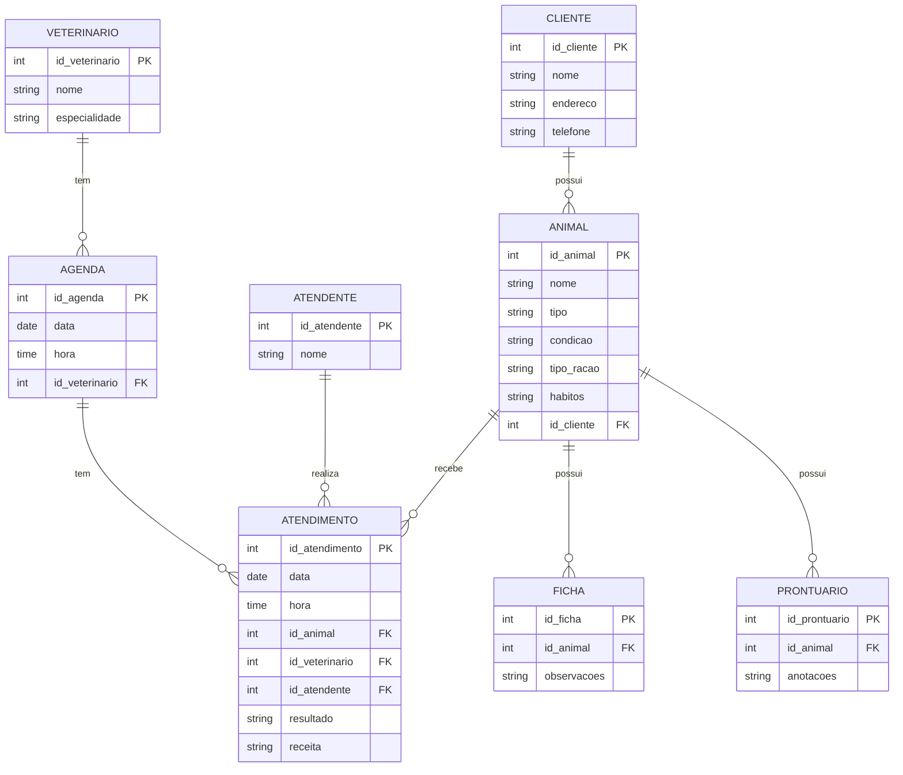
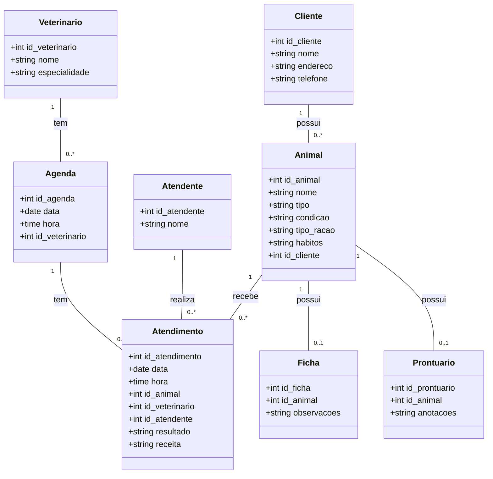

# Repositório da eng. de sw.

Repositório, Gerencia de proj sw. 2024/2


- [Repositório da eng. de sw.](#repositório-da-eng-de-sw)
- [1. Introdução](#1-introdução)
- [2. Descrição do negócio.](#2-descrição-do-negócio)
- [3. Visão geral do sistema](#3-visão-geral-do-sistema)
- [4. Diagrama ER](#4-diagrama-er)
  - [4.1 Descrição das Entidades e Relacionamentos](#41-descrição-das-entidades-e-relacionamentos)
  - [4.2 Relacionamentos](#42-relacionamentos)
- [5. Diagrama de classe](#5-diagrama-de-classe)
  - [5.1. Descrição das Classes e Relacionamentos](#51-descrição-das-classes-e-relacionamentos)
  - [5.2. Relacionamentos](#52-relacionamentos)
- [6. Casos de uso](#6-casos-de-uso)
  - [6.1. Histórias de usuário](#61-histórias-de-usuário)
    - [6.1.1. História de Usuário 1: Cadastro de Cliente](#611-história-de-usuário-1-cadastro-de-cliente)
    - [6.1.2. História de Usuário 2: Cadastro de Animal](#612-história-de-usuário-2-cadastro-de-animal)
    - [6.1.3. História de Usuário 3: Informar Condições e Hábitos do Animal](#613-história-de-usuário-3-informar-condições-e-hábitos-do-animal)
    - [6.1.4. História de Usuário 4: Informar Tipo de Ração](#614-história-de-usuário-4-informar-tipo-de-ração)
    - [6.1.5. História de Usuário 5: Marcar Atendimento Futuro](#615-história-de-usuário-5-marcar-atendimento-futuro)
    - [6.1.6. História de Usuário 6: Atendimento pelo Atendente](#616-história-de-usuário-6-atendimento-pelo-atendente)
    - [6.1.7. História de Usuário 7: Entrevista e Exame pelo Veterinário](#617-história-de-usuário-7-entrevista-e-exame-pelo-veterinário)
    - [6.1.8. História de Usuário 8: Gerar Receita](#618-história-de-usuário-8-gerar-receita)
    - [6.1.9. História de Usuário 9: Criar Ficha e Prontuário](#619-história-de-usuário-9-criar-ficha-e-prontuário)
    - [6.1.10. História de Usuário 10: Acesso às Informações de Atendimento](#6110-história-de-usuário-10-acesso-às-informações-de-atendimento)
- [7. Diagrama de componentes](#7-diagrama-de-componentes)
- [8. Diagrama de implantação](#8-diagrama-de-implantação)
- [9. Protótipo de telas](#9-protótipo-de-telas)
- [10. Diagrama de navegação de telas](#10-diagrama-de-navegação-de-telas)
- [11. Pilha tecnológica](#11-pilha-tecnológica)
- [12. Requisitos de sistemas](#12-requisitos-de-sistemas)
- [13. Considerações sobre segurança](#13-considerações-sobre-segurança)
- [14. Manutenção e instalação](#14-manutenção-e-instalação)
- [15. Glossário](#15-glossário)
- [16. Script SQL](#16-script-sql)


# 1. Introdução

O projeto a seguir apresenta um sistema desenvolvidor para uma petshop. A empresa é considerada micro e iniciou as atividades recentemente. Ao possuir serviços exclusivos, os sistemas presentes no mercado não se enquadra, desta forma, os proprietários decidiram desenvolver uma solução própria. Esta solução é detalhda a seguir:

# 2. Descrição do negócio.

Descrição do cenário onde o sistema deverá funcionar:

1.	Uma clínica veterinária atende apenas os animais: gatos e cachorros. 
2.	Os clientes devem fazer um cadastro de si e dos animais. 
3.	Os clientes devem informar as condições nas quais os animais chegam. 
4.	Os clientes devem informar o tipo de ração que o animal come. 
5.	O cliente deve informar hábitos do animal. 
6.	Para cada animal é possível que mais de um veterinário o atenda. 
7.	Os animais podem chegar e serem atendidos de acordo com uma agenda do dia. 
8.	Cada animal atendido receberá uma ficha e um prontuário. 
9.	Outros dono podem querer marcar horários de atendimento futuro. 
10.	O atendimento gera uma receita para o animal. 
11.	Quando um cliente chega na clínica veterinária ele é atendido por um atendente. 
12.	O atendente deve verificar se existe agenda disponível com um veterinário. 
13.	O atendente deve colocar o cliente e seu animal na fila de espera, se for o caso. 
14.	O atendente deve levar o cliente e o animal até o veterinário. 
15.	O veterinário deve realizar uma entrevista com o dono do animal. 
16.	O resultado da entrevista deve ir para um formulário. 
17.	O veterinário deverá examinar o animal e anotar em prontuário(ficha) suas observações. 
18.	Dependendo da situação do animal este receberá uma receita.
19.	
20.	
21.	
22.	
23.	
24.	
25.
26.
27.
28.
29.
30.	


# 3. Visão geral do sistema

Descrição do sistema e suas relações.

# 4. Diagrama ER




## 4.1 Descrição das Entidades e Relacionamentos

- **CLIENTE**: Contém informações sobre os clientes da clínica.
- **ANIMAL**: Contém informações sobre os animais que pertencem aos clientes.
- **VETERINARIO**: Contém informações sobre os veterinários.
- **ATENDENTE**: Contém informações sobre os atendentes.
- **AGENDA**: Contém informações sobre horários disponíveis para atendimento.
- **ATENDIMENTO**: Registra os atendimentos realizados para os animais.
- **FICHA**: Contém observações feitas pelo veterinário durante o atendimento.
- **PRONTUARIO**: Contém anotações adicionais feitas pelo veterinário.

## 4.2 Relacionamentos

- **CLIENTE** pode ter vários **ANIMAL**s.
- **ANIMAL** pode receber vários **ATENDIMENTO**s.
- **VETERINARIO** pode ter várias **AGENDA**s.
- **AGENDA** pode ter vários **ATENDIMENTO**s.
- **ATENDENTE** pode realizar vários **ATENDIMENTO**s.
- **ANIMAL** pode ter uma **FICHA**.
- **ANIMAL** pode ter um **PRONTUARIO**.


# 5. Diagrama de classe



## 5.1. Descrição das Classes e Relacionamentos

- **Cliente**: Contém informações sobre os clientes da clínica. Um cliente pode ter vários animais.
- **Animal**: Contém informações sobre os animais, como nome, tipo, condição, tipo de ração e hábitos. Um animal pode receber vários atendimentos.
- **Veterinario**: Contém informações sobre os veterinários, como nome e especialidade. Um veterinário pode ter várias agendas.
- **Atendente**: Contém informações sobre os atendentes da clínica. Um atendente pode realizar vários atendimentos.
- **Agenda**: Contém informações sobre os horários disponíveis para atendimento. Cada agenda está associada a um veterinário e pode ter vários atendimentos.
- **Atendimento**: Registra os atendimentos realizados, incluindo data, hora, resultados e receitas. Cada atendimento está associado a um animal, um veterinário e um atendente.
- **Ficha**: Contém observações feitas pelo veterinário durante o atendimento. Cada animal pode ter uma ficha.
- **Prontuario**: Contém anotações adicionais feitas pelo veterinário. Cada animal pode ter um prontuário.

## 5.2. Relacionamentos

- **Cliente** pode ter vários **Animal**s.
- **Animal** pode ter vários **Atendimento**s.
- **Veterinario** pode ter várias **Agenda**s.
- **Agenda** pode ter vários **Atendimento**s.
- **Atendente** pode realizar vários **Atendimento**s.
- **Animal** pode ter uma **Ficha**.
- **Animal** pode ter um **Prontuario**.


# 6. Casos de uso

## 6.1. Histórias de usuário


### 6.1.1. História de Usuário 1: Cadastro de Cliente

```
**Como** um novo cliente,  
**Quero** cadastrar minhas informações pessoais na clínica veterinária,  
**Para que** eu possa ser identificado e contatado pela clínica quando necessário.

**Critérios de Aceitação:**
- O cliente pode inserir seu nome, endereço e telefone.
- O sistema deve armazenar essas informações e associá-las ao cliente.
```


### 6.1.2. História de Usuário 2: Cadastro de Animal

```
**Como** um cliente,  
**Quero** cadastrar meus animais na clínica,  
**Para que** eu possa acompanhar os atendimentos e necessidades de cada um.

**Critérios de Aceitação:**
- O cliente pode inserir o nome, tipo (gato ou cachorro), condição, tipo de ração e hábitos do animal.
- O sistema deve associar o animal ao cliente que o cadastrou.
```


### 6.1.3. História de Usuário 3: Informar Condições e Hábitos do Animal

```
**Como** um cliente,  
**Quero** informar as condições nas quais meu animal chega e seus hábitos,  
**Para que** o veterinário tenha informações completas sobre o estado do animal.

**Critérios de Aceitação:**
- O cliente pode adicionar informações sobre a condição e hábitos do animal durante o cadastro ou na atualização do perfil do animal.
- Essas informações devem ser armazenadas no perfil do animal.
```

### 6.1.4. História de Usuário 4: Informar Tipo de Ração

```
**Como** um cliente,  
**Quero** informar o tipo de ração que meu animal come,  
**Para que** o veterinário possa considerar isso durante o atendimento.

**Critérios de Aceitação:**
- O cliente pode adicionar o tipo de ração que o animal consome.
- O sistema deve armazenar essa informação e associá-la ao perfil do animal.
```


### 6.1.5. História de Usuário 5: Marcar Atendimento Futuro

```
**Como** um cliente,  
**Quero** marcar horários de atendimento futuros para meu animal,  
**Para que** eu possa garantir que meu animal será atendido quando necessário.

**Critérios de Aceitação:**
- O cliente pode solicitar uma marcação de horário para atendimento futuro.
- O sistema deve verificar a disponibilidade na agenda dos veterinários e confirmar a marcação.
```


### 6.1.6. História de Usuário 6: Atendimento pelo Atendente

```
**Como** um cliente,  
**Quero** ser atendido por um atendente ao chegar na clínica,  
**Para que** eu possa ser direcionado adequadamente e verificar a disponibilidade de horários para atendimento.

**Critérios de Aceitação:**
- O atendente deve verificar a disponibilidade de horários com os veterinários.
- O atendente deve colocar o cliente e o animal na fila de espera, se necessário, e direcioná-los ao veterinário.
```


### 6.1.7. História de Usuário 7: Entrevista e Exame pelo Veterinário

```
**Como** um veterinário,  
**Quero** realizar uma entrevista com o dono do animal e examinar o animal,  
**Para que** eu possa entender o estado do animal e registrar minhas observações.

**Critérios de Aceitação:**
- O veterinário deve poder registrar as observações durante a entrevista e o exame.
- O resultado da entrevista deve ser registrado em um formulário.
- As observações do exame devem ser anotadas no prontuário do animal.
```


### 6.1.8. História de Usuário 8: Gerar Receita

```
**Como** um veterinário,  
**Quero** gerar uma receita para o animal,  
**Para que** o cliente possa seguir as recomendações de tratamento.

**Critérios de Aceitação:**
- O veterinário deve poder registrar uma receita para o animal, se necessário.
- A receita deve ser vinculada ao atendimento e disponível para o cliente.
```


### 6.1.9. História de Usuário 9: Criar Ficha e Prontuário

```
**Como** um veterinário,  
**Quero** criar uma ficha e um prontuário para o animal atendido,  
**Para que** haja um registro completo das observações e tratamentos recomendados.

**Critérios de Aceitação:**
- O veterinário deve poder criar e associar uma ficha ao animal.
- O prontuário deve conter todas as anotações e observações do atendimento.
```


### 6.1.10. História de Usuário 10: Acesso às Informações de Atendimento

```
**Como** um cliente,  
**Quero** acessar as informações de atendimento e registros de meus animais,  
**Para que** eu possa acompanhar o histórico de atendimentos e recomendações.

**Critérios de Aceitação:**
- O cliente deve poder visualizar o histórico de atendimentos, fichas e prontuários dos seus animais.
- As informações devem estar organizadas e acessíveis na interface do cliente.
```


# 7. Diagrama de componentes

# 8. Diagrama de implantação

# 9. Protótipo de telas

# 10. Diagrama de navegação de telas

# 11. Pilha tecnológica

# 12. Requisitos de sistemas

# 13. Considerações sobre segurança

# 14. Manutenção e instalação

# 15. Glossário

# 16. Script SQL

