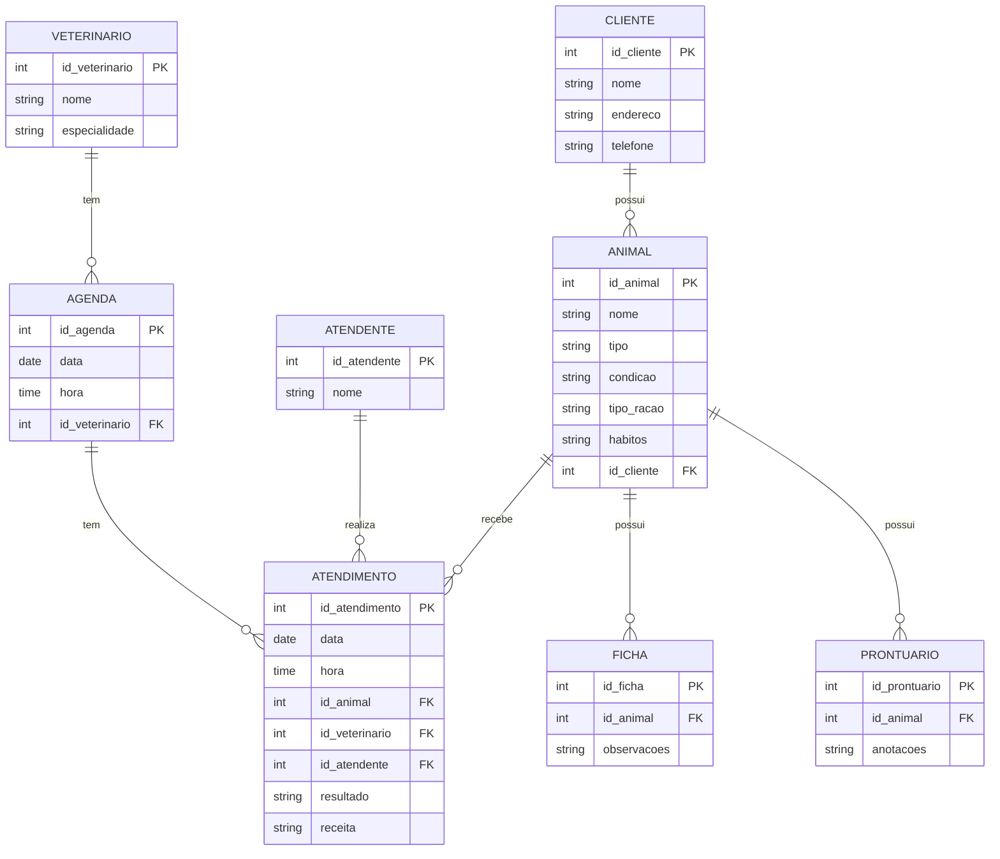
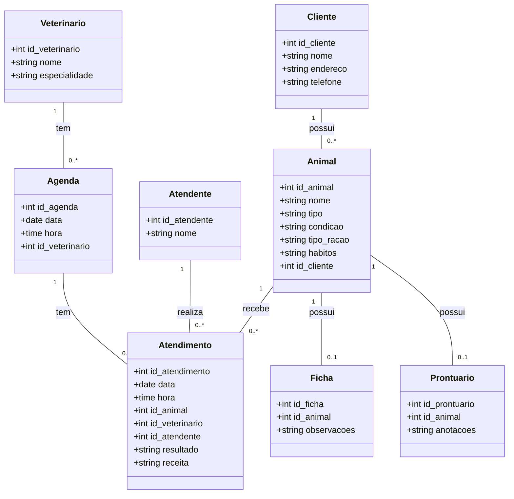
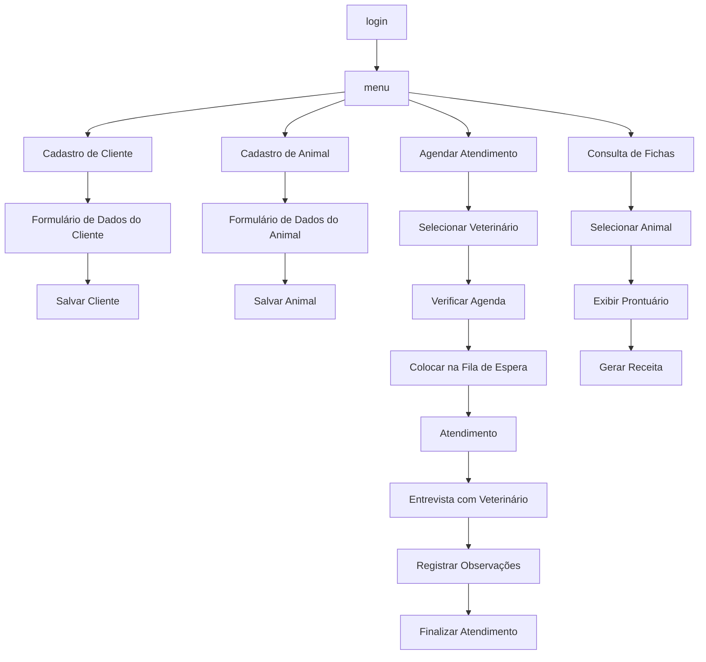

# Repositório da eng. de sw.

Repositório, Gerencia de proj sw. 2024/2


- [Repositório da eng. de sw.](#repositório-da-eng-de-sw)
- [1. Introdução](#1-introdução)
- [2. Descrição do negócio.](#2-descrição-do-negócio)
- [3. Visão geral do sistema](#3-visão-geral-do-sistema)
- [4. Diagrama ER](#4-diagrama-er)
  - [4.1 Descrição das Entidades e Relacionamentos](#41-descrição-das-entidades-e-relacionamentos)
  - [4.2 Relacionamentos](#42-relacionamentos)
- [5. Diagrama de classe](#5-diagrama-de-classe)
  - [5.1. Descrição das Classes e Relacionamentos](#51-descrição-das-classes-e-relacionamentos)
  - [5.2. Relacionamentos](#52-relacionamentos)
- [6. Casos de uso](#6-casos-de-uso)
  - [6.1. Casos de uso](#61-casos-de-uso)
  - [6.2. Histórias de usuário](#62-histórias-de-usuário)
    - [6.2.1. História de Usuário 1: Cadastro de Cliente](#621-história-de-usuário-1-cadastro-de-cliente)
    - [6.2.2. História de Usuário 2: Cadastro de Animal](#622-história-de-usuário-2-cadastro-de-animal)
    - [6.2.3. História de Usuário 3: Informar Condições e Hábitos do Animal](#623-história-de-usuário-3-informar-condições-e-hábitos-do-animal)
    - [6.2.4. História de Usuário 4: Informar Tipo de Ração](#624-história-de-usuário-4-informar-tipo-de-ração)
    - [6.2.5. História de Usuário 5: Marcar Atendimento Futuro](#625-história-de-usuário-5-marcar-atendimento-futuro)
    - [6.2.6. História de Usuário 6: Atendimento pelo Atendente](#626-história-de-usuário-6-atendimento-pelo-atendente)
    - [6.2.7. História de Usuário 7: Entrevista e Exame pelo Veterinário](#627-história-de-usuário-7-entrevista-e-exame-pelo-veterinário)
    - [6.2.8. História de Usuário 8: Gerar Receita](#628-história-de-usuário-8-gerar-receita)
    - [6.2.9. História de Usuário 9: Criar Ficha e Prontuário](#629-história-de-usuário-9-criar-ficha-e-prontuário)
    - [6.2.10. História de Usuário 10: Acesso às Informações de Atendimento](#6210-história-de-usuário-10-acesso-às-informações-de-atendimento)
- [7. Diagrama de componentes](#7-diagrama-de-componentes)
- [8. Diagrama de implantação](#8-diagrama-de-implantação)
- [9. Protótipo de telas](#9-protótipo-de-telas)
- [10. Diagrama de navegação de telas](#10-diagrama-de-navegação-de-telas)
- [11. Pilha tecnológica](#11-pilha-tecnológica)
- [12. Requisitos de sistemas](#12-requisitos-de-sistemas)
- [13. Considerações sobre segurança](#13-considerações-sobre-segurança)
- [14. Manutenção e instalação](#14-manutenção-e-instalação)
- [15. Glossário](#15-glossário)
- [16. Script SQL](#16-script-sql)
  - [16.1. Comandos CREATE table:](#161-comandos-create-table)
  - [16.2. Comandos INSERT gerando dados fictícios:](#162-comandos-insert-gerando-dados-fictícios)
    - [16.2.1. Explicação dos dados fictícios:](#1621-explicação-dos-dados-fictícios)


# 1. Introdução

O projeto a seguir apresenta um sistema desenvolvidor para uma petshop. A empresa é considerada micro e iniciou as atividades recentemente. Ao possuir serviços exclusivos, os sistemas presentes no mercado não se enquadra, desta forma, os proprietários decidiram desenvolver uma solução própria. Esta solução é detalhda a seguir:

# 2. Descrição do negócio.

Descrição do cenário onde o sistema deverá funcionar:

1.	Uma clínica veterinária atende apenas os animais: gatos e cachorros. 
2.	Os clientes devem fazer um cadastro de si e dos animais. 
3.	Os clientes devem informar as condições nas quais os animais chegam. 
4.	Os clientes devem informar o tipo de ração que o animal come. 
5.	O cliente deve informar hábitos do animal. 
6.	Para cada animal é possível que mais de um veterinário o atenda. 
7.	Os animais podem chegar e serem atendidos de acordo com uma agenda do dia. 
8.	Cada animal atendido receberá uma ficha e um prontuário. 
9.	Outros dono podem querer marcar horários de atendimento futuro. 
10.	O atendimento gera uma receita para o animal. 
11.	Quando um cliente chega na clínica veterinária ele é atendido por um atendente. 
12.	O atendente deve verificar se existe agenda disponível com um veterinário. 
13.	O atendente deve colocar o cliente e seu animal na fila de espera, se for o caso. 
14.	O atendente deve levar o cliente e o animal até o veterinário. 
15.	O veterinário deve realizar uma entrevista com o dono do animal. 
16.	O resultado da entrevista deve ir para um formulário. 
17.	O veterinário deverá examinar o animal e anotar em prontuário(ficha) suas observações. 
18.	Dependendo da situação do animal este receberá uma receita.
19.	
20.	
21.	
22.	
23.	
24.	
25.
26.
27.
28.
29.
30.	


# 3. Visão geral do sistema

Descrição do sistema e suas relações.

# 4. Diagrama ER





## 4.1 Descrição das Entidades e Relacionamentos

- **CLIENTE**: Contém informações sobre os clientes da clínica.
- **ANIMAL**: Contém informações sobre os animais que pertencem aos clientes.
- **VETERINARIO**: Contém informações sobre os veterinários.
- **ATENDENTE**: Contém informações sobre os atendentes.
- **AGENDA**: Contém informações sobre horários disponíveis para atendimento.
- **ATENDIMENTO**: Registra os atendimentos realizados para os animais.
- **FICHA**: Contém observações feitas pelo veterinário durante o atendimento.
- **PRONTUARIO**: Contém anotações adicionais feitas pelo veterinário.

## 4.2 Relacionamentos

- **CLIENTE** pode ter vários **ANIMAL**s.
- **ANIMAL** pode receber vários **ATENDIMENTO**s.
- **VETERINARIO** pode ter várias **AGENDA**s.
- **AGENDA** pode ter vários **ATENDIMENTO**s.
- **ATENDENTE** pode realizar vários **ATENDIMENTO**s.
- **ANIMAL** pode ter uma **FICHA**.
- **ANIMAL** pode ter um **PRONTUARIO**.


# 5. Diagrama de classe



## 5.1. Descrição das Classes e Relacionamentos

- **Cliente**: Contém informações sobre os clientes da clínica. Um cliente pode ter vários animais.
- **Animal**: Contém informações sobre os animais, como nome, tipo, condição, tipo de ração e hábitos. Um animal pode receber vários atendimentos.
- **Veterinario**: Contém informações sobre os veterinários, como nome e especialidade. Um veterinário pode ter várias agendas.
- **Atendente**: Contém informações sobre os atendentes da clínica. Um atendente pode realizar vários atendimentos.
- **Agenda**: Contém informações sobre os horários disponíveis para atendimento. Cada agenda está associada a um veterinário e pode ter vários atendimentos.
- **Atendimento**: Registra os atendimentos realizados, incluindo data, hora, resultados e receitas. Cada atendimento está associado a um animal, um veterinário e um atendente.
- **Ficha**: Contém observações feitas pelo veterinário durante o atendimento. Cada animal pode ter uma ficha.
- **Prontuario**: Contém anotações adicionais feitas pelo veterinário. Cada animal pode ter um prontuário.

## 5.2. Relacionamentos

- **Cliente** pode ter vários **Animal**s.
- **Animal** pode ter vários **Atendimento**s.
- **Veterinario** pode ter várias **Agenda**s.
- **Agenda** pode ter vários **Atendimento**s.
- **Atendente** pode realizar vários **Atendimento**s.
- **Animal** pode ter uma **Ficha**.
- **Animal** pode ter um **Prontuario**.


# 6. Casos de uso

## 6.1. Casos de uso

:bulb: **Dica:** Situações de utilização do sistema.


## 6.2. Histórias de usuário

:bulb: **Dica:** .

### 6.2.1. História de Usuário 1: Cadastro de Cliente

```
**Como** um novo cliente,  
**Quero** cadastrar minhas informações pessoais na clínica veterinária,  
**Para que** eu possa ser identificado e contatado pela clínica quando necessário.

**Critérios de Aceitação:**
- O cliente pode inserir seu nome, endereço e telefone.
- O sistema deve armazenar essas informações e associá-las ao cliente.
```


### 6.2.2. História de Usuário 2: Cadastro de Animal

```
**Como** um cliente,  
**Quero** cadastrar meus animais na clínica,  
**Para que** eu possa acompanhar os atendimentos e necessidades de cada um.

**Critérios de Aceitação:**
- O cliente pode inserir o nome, tipo (gato ou cachorro), condição, tipo de ração e hábitos do animal.
- O sistema deve associar o animal ao cliente que o cadastrou.
```


### 6.2.3. História de Usuário 3: Informar Condições e Hábitos do Animal

```
**Como** um cliente,  
**Quero** informar as condições nas quais meu animal chega e seus hábitos,  
**Para que** o veterinário tenha informações completas sobre o estado do animal.

**Critérios de Aceitação:**
- O cliente pode adicionar informações sobre a condição e hábitos do animal durante o cadastro ou na atualização do perfil do animal.
- Essas informações devem ser armazenadas no perfil do animal.
```

### 6.2.4. História de Usuário 4: Informar Tipo de Ração

```
**Como** um cliente,  
**Quero** informar o tipo de ração que meu animal come,  
**Para que** o veterinário possa considerar isso durante o atendimento.

**Critérios de Aceitação:**
- O cliente pode adicionar o tipo de ração que o animal consome.
- O sistema deve armazenar essa informação e associá-la ao perfil do animal.
```


### 6.2.5. História de Usuário 5: Marcar Atendimento Futuro

```
**Como** um cliente,  
**Quero** marcar horários de atendimento futuros para meu animal,  
**Para que** eu possa garantir que meu animal será atendido quando necessário.

**Critérios de Aceitação:**
- O cliente pode solicitar uma marcação de horário para atendimento futuro.
- O sistema deve verificar a disponibilidade na agenda dos veterinários e confirmar a marcação.
```


### 6.2.6. História de Usuário 6: Atendimento pelo Atendente

```
**Como** um cliente,  
**Quero** ser atendido por um atendente ao chegar na clínica,  
**Para que** eu possa ser direcionado adequadamente e verificar a disponibilidade de horários para atendimento.

**Critérios de Aceitação:**
- O atendente deve verificar a disponibilidade de horários com os veterinários.
- O atendente deve colocar o cliente e o animal na fila de espera, se necessário, e direcioná-los ao veterinário.
```


### 6.2.7. História de Usuário 7: Entrevista e Exame pelo Veterinário

```
**Como** um veterinário,  
**Quero** realizar uma entrevista com o dono do animal e examinar o animal,  
**Para que** eu possa entender o estado do animal e registrar minhas observações.

**Critérios de Aceitação:**
- O veterinário deve poder registrar as observações durante a entrevista e o exame.
- O resultado da entrevista deve ser registrado em um formulário.
- As observações do exame devem ser anotadas no prontuário do animal.
```


### 6.2.8. História de Usuário 8: Gerar Receita

```
**Como** um veterinário,  
**Quero** gerar uma receita para o animal,  
**Para que** o cliente possa seguir as recomendações de tratamento.

**Critérios de Aceitação:**
- O veterinário deve poder registrar uma receita para o animal, se necessário.
- A receita deve ser vinculada ao atendimento e disponível para o cliente.
```


### 6.2.9. História de Usuário 9: Criar Ficha e Prontuário

```
**Como** um veterinário,  
**Quero** criar uma ficha e um prontuário para o animal atendido,  
**Para que** haja um registro completo das observações e tratamentos recomendados.

**Critérios de Aceitação:**
- O veterinário deve poder criar e associar uma ficha ao animal.
- O prontuário deve conter todas as anotações e observações do atendimento.
```


### 6.2.10. História de Usuário 10: Acesso às Informações de Atendimento

```
**Como** um cliente,  
**Quero** acessar as informações de atendimento e registros de meus animais,  
**Para que** eu possa acompanhar o histórico de atendimentos e recomendações.

**Critérios de Aceitação:**
- O cliente deve poder visualizar o histórico de atendimentos, fichas e prontuários dos seus animais.
- As informações devem estar organizadas e acessíveis na interface do cliente.
```


# 7. Diagrama de componentes


# 8. Diagrama de implantação


# 9. Protótipo de telas

# 10. Diagrama de navegação de telas




# 11. Pilha tecnológica

```mermaid

graph TD;
    A[Pilha Tecnológica do Sistema Web] --> B[Servidor Web]
    A --> C[Linguagem de Programação]
    A --> D[Sistema de Gerenciamento de Banco de Dados]
    A --> E[Ambiente de Desenvolvimento]
    A --> F[Controle de Versão]
    A --> G[Frameworks e Bibliotecas]
    A --> H[Segurança]
    A --> I[Testes]
    A --> J[Gerenciamento de Dependências]
    A --> K[Documentação]
    
    B --> B1[Apache HTTP Server]
    B --> B2[XAMPP/WAMP/MAMP]

    C --> C1[PHP]
    
    D --> D1[MySQL]
    D --> D2[MySQL Workbench]
    D --> D3[phpMyAdmin]

    E --> E1[Visual Studio Code]
    E --> E2[Sublime Text]
    E --> E3[PHPStorm]

    F --> F1[Git]
    F --> F2[GitHub]
    F --> F3[GitLab]
    F --> F4[Bitbucket]

    G --> G1[Laravel]
    G --> G2[CodeIgniter]
    G --> G3[Bootstrap]

    H --> H1[SSL/TLS]
    H --> H2[Let’s Encrypt]

    I --> I1[PHPUnit]
    I --> I2[Postman]

    J --> J1[Composer]

    K --> K1[Markdown]
```




# 12. Requisitos de sistemas

# 13. Considerações sobre segurança

# 14. Manutenção e instalação

# 15. Glossário

# 16. Script SQL

## 16.1. Comandos CREATE table:

```SQL

-- Tabela de Clientes
CREATE TABLE clientes (
    id_cliente INT AUTO_INCREMENT PRIMARY KEY,
    nome VARCHAR(100) NOT NULL,
    endereco VARCHAR(255),
    telefone VARCHAR(20),
    email VARCHAR(100)
);

-- Tabela de Animais (gatos e cachorros)
CREATE TABLE animais (
    id_animal INT AUTO_INCREMENT PRIMARY KEY,
    id_cliente INT,
    nome VARCHAR(100) NOT NULL,
    especie ENUM('Gato', 'Cachorro') NOT NULL,
    idade INT,
    raca VARCHAR(100),
    tipo_racao VARCHAR(100),
    habitos TEXT,
    FOREIGN KEY (id_cliente) REFERENCES clientes(id_cliente)
);

-- Tabela de Veterinários
CREATE TABLE veterinarios (
    id_veterinario INT AUTO_INCREMENT PRIMARY KEY,
    nome VARCHAR(100) NOT NULL,
    especialidade VARCHAR(100),
    telefone VARCHAR(20)
);

-- Tabela de Condições dos Animais
CREATE TABLE condicoes (
    id_condicao INT AUTO_INCREMENT PRIMARY KEY,
    descricao TEXT NOT NULL
);

-- Tabela de Atendimento
CREATE TABLE atendimentos (
    id_atendimento INT AUTO_INCREMENT PRIMARY KEY,
    id_animal INT,
    id_cliente INT,
    id_veterinario INT,
    data_atendimento DATETIME NOT NULL,
    condicao_animal INT,
    ficha TEXT,
    prontuario TEXT,
    receita TEXT,
    FOREIGN KEY (id_animal) REFERENCES animais(id_animal),
    FOREIGN KEY (id_cliente) REFERENCES clientes(id_cliente),
    FOREIGN KEY (id_veterinario) REFERENCES veterinarios(id_veterinario),
    FOREIGN KEY (condicao_animal) REFERENCES condicoes(id_condicao)
);

-- Tabela de Agenda
CREATE TABLE agendas (
    id_agenda INT AUTO_INCREMENT PRIMARY KEY,
    id_veterinario INT,
    id_animal INT,
    data_horario DATETIME NOT NULL,
    status ENUM('Agendado', 'Concluído', 'Cancelado') NOT NULL DEFAULT 'Agendado',
    FOREIGN KEY (id_veterinario) REFERENCES veterinarios(id_veterinario),
    FOREIGN KEY (id_animal) REFERENCES animais(id_animal)
);

-- Tabela de Atendentes
CREATE TABLE atendentes (
    id_atendente INT AUTO_INCREMENT PRIMARY KEY,
    nome VARCHAR(100) NOT NULL,
    telefone VARCHAR(20)
);

-- Tabela de Fila de Espera
CREATE TABLE fila_espera (
    id_fila INT AUTO_INCREMENT PRIMARY KEY,
    id_cliente INT,
    id_animal INT,
    id_atendente INT,
    id_veterinario INT,
    data_entrada DATETIME NOT NULL,
    status ENUM('Aguardando', 'Atendido', 'Cancelado') NOT NULL DEFAULT 'Aguardando',
    FOREIGN KEY (id_cliente) REFERENCES clientes(id_cliente),
    FOREIGN KEY (id_animal) REFERENCES animais(id_animal),
    FOREIGN KEY (id_atendente) REFERENCES atendentes(id_atendente),
    FOREIGN KEY (id_veterinario) REFERENCES veterinarios(id_veterinario)
);

-- Tabela de Entrevista (formulário preenchido pelo veterinário)
CREATE TABLE entrevistas (
    id_entrevista INT AUTO_INCREMENT PRIMARY KEY,
    id_atendimento INT,
    observacoes TEXT,
    FOREIGN KEY (id_atendimento) REFERENCES atendimentos(id_atendimento)
);
```


## 16.2. Comandos INSERT gerando dados fictícios:

```SQL
-- Inserindo clientes
INSERT INTO clientes (nome, endereco, telefone, email) VALUES
('João da Silva', 'Rua A, 123', '11987654321', 'joao.silva@example.com'),
('Maria Oliveira', 'Avenida B, 456', '11987654322', 'maria.oliveira@example.com'),
('Carlos Souza', 'Rua C, 789', '11987654323', 'carlos.souza@example.com');

-- Inserindo animais
INSERT INTO animais (id_cliente, nome, especie, idade, raca, tipo_racao, habitos) VALUES
(1, 'Rex', 'Cachorro', 5, 'Labrador', 'Ração Premium', 'Corre todos os dias'),
(2, 'Mimi', 'Gato', 3, 'Persa', 'Ração Especial', 'Dormir durante o dia'),
(3, 'Bolinha', 'Cachorro', 2, 'Poodle', 'Ração Econômica', 'Brincar com bola');

-- Inserindo veterinários
INSERT INTO veterinarios (nome, especialidade, telefone) VALUES
('Dr. Ana Pereira', 'Clínica Geral', '11987654324'),
('Dr. Pedro Santos', 'Ortopedia', '11987654325'),
('Dra. Carla Lima', 'Dermatologia', '11987654326');

-- Inserindo condições dos animais
INSERT INTO condicoes (descricao) VALUES
('Febre e falta de apetite'),
('Fratura na pata traseira'),
('Coceira excessiva e perda de pelos');

-- Inserindo atendimentos
INSERT INTO atendimentos (id_animal, id_cliente, id_veterinario, data_atendimento, condicao_animal, ficha, prontuario, receita) VALUES
(1, 1, 1, '2024-09-17 10:00:00', 1, 'Animal com febre alta', 'Exame físico realizado. Diagnóstico preliminar: infecção', 'Antibiótico por 7 dias'),
(2, 2, 2, '2024-09-17 11:00:00', 2, 'Fratura detectada na pata traseira', 'Raio-X realizado. Fratura confirmada.', 'Imobilização e repouso'),
(3, 3, 3, '2024-09-17 12:00:00', 3, 'Coceira e irritação na pele', 'Exame dermatológico. Alergia detectada.', 'Corticoide tópico');

-- Inserindo agendas
INSERT INTO agendas (id_veterinario, id_animal, data_horario, status) VALUES
(1, 1, '2024-09-17 10:00:00', 'Concluído'),
(2, 2, '2024-09-17 11:00:00', 'Concluído'),
(3, 3, '2024-09-17 12:00:00', 'Concluído');

-- Inserindo atendentes
INSERT INTO atendentes (nome, telefone) VALUES
('Patrícia Gomes', '11987654327'),
('Lucas Mendes', '11987654328');

-- Inserindo fila de espera
INSERT INTO fila_espera (id_cliente, id_animal, id_atendente, id_veterinario, data_entrada, status) VALUES
(1, 1, 1, 1, '2024-09-17 09:45:00', 'Atendido'),
(2, 2, 2, 2, '2024-09-17 10:30:00', 'Atendido'),
(3, 3, 1, 3, '2024-09-17 11:45:00', 'Atendido');

-- Inserindo entrevistas
INSERT INTO entrevistas (id_atendimento, observacoes) VALUES
(1, 'Dono relata que o animal parou de comer há 2 dias.'),
(2, 'Dono diz que o animal caiu da escada.'),
(3, 'Dono nota que o animal se coça frequentemente nas últimas semanas.');

```

### 16.2.1. Explicação dos dados fictícios:

* Clientes: João, Maria e Carlos são clientes da clínica, cada um com informações de contato.
* Animais: Rex (cachorro), Mimi (gato) e Bolinha (cachorro) são os animais dos clientes.
* Veterinários: Dr. Ana, Dr. Pedro e Dra. Carla são os veterinários com diferentes especialidades.
* Condições dos animais: Febre, fratura e coceira são exemplos de condições tratadas na clínica.
* Atendimentos: Registros de atendimentos realizados para cada animal, com ficha, prontuário e receita.
* Agendas: Agenda dos veterinários para os animais em horários específicos.
* Atendentes: Patrícia e Lucas são os atendentes responsáveis.
* Fila de espera: Fila de clientes e animais aguardando atendimento.
* Entrevistas: Observações feitas durante a entrevista entre veterinário e dono do animal.

