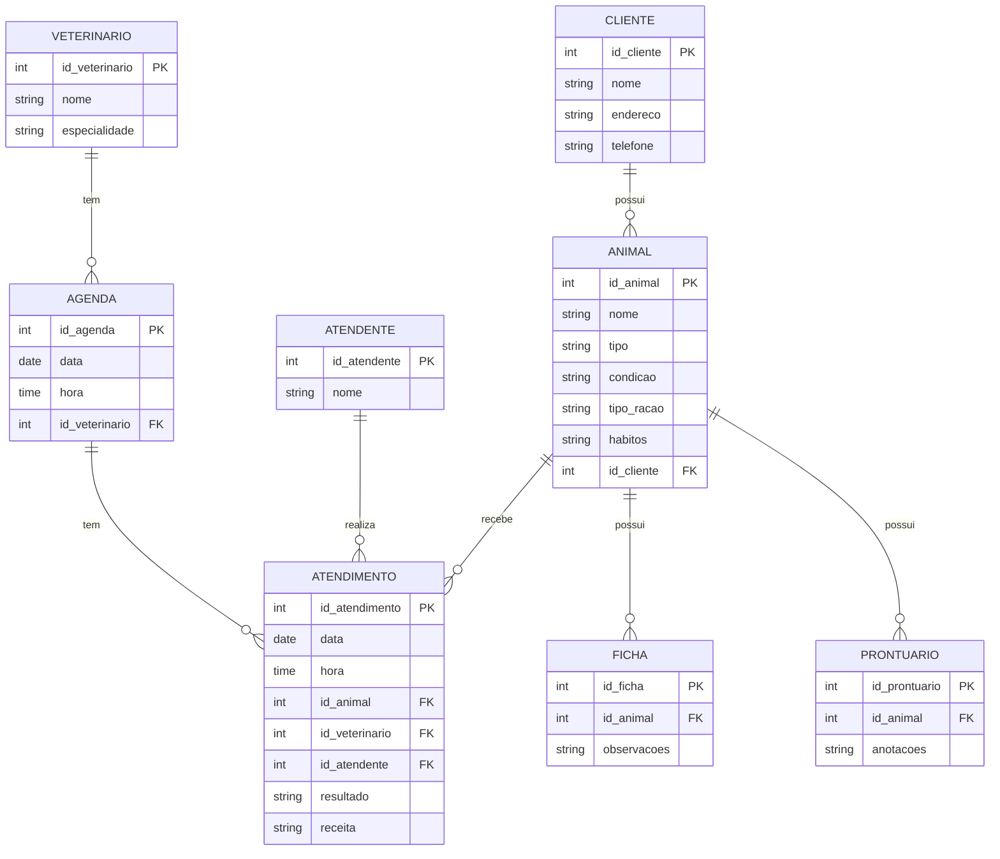

# Repositório da eng. de sw.

Repositório, Gerencia de proj sw. 2024/2

- [Repositório da eng. de sw.](#repositório-da-eng-de-sw)
- [1. Introdução](#1-introdução)
- [2. Descrição do negócio.](#2-descrição-do-negócio)
- [3. Visão geral do sistema](#3-visão-geral-do-sistema)
- [4. Diagrama ER](#4-diagrama-er)
  - [4.1 Descrição das Entidades e Relacionamentos](#41-descrição-das-entidades-e-relacionamentos)
  - [4.2 Relacionamentos](#42-relacionamentos)
- [5. Diagrama de classe](#5-diagrama-de-classe)
- [6. Casos de uso](#6-casos-de-uso)
  - [6.1. Histórias de usuário](#61-histórias-de-usuário)
- [7. Diagrama de componentes](#7-diagrama-de-componentes)
- [8. Diagrama de implantação](#8-diagrama-de-implantação)
- [9. Protótipo de telas](#9-protótipo-de-telas)
- [10. Diagrama de navegação de telas](#10-diagrama-de-navegação-de-telas)
- [11. Pilha tecnológica](#11-pilha-tecnológica)
- [12. Requisitos de sistemas](#12-requisitos-de-sistemas)
- [13. Considerações sobre segurança](#13-considerações-sobre-segurança)
- [14. Manutenção e instalação](#14-manutenção-e-instalação)
- [15. Glossário](#15-glossário)
- [16. Script SQL](#16-script-sql)

# 1. Introdução

O projeto a seguir apresenta um sistema desenvolvidor para uma petshop. A empresa é considerada micro e iniciou as atividades recentemente. Ao possuir serviços exclusivos, os sistemas presentes no mercado não se enquadra, desta forma, os proprietários decidiram desenvolver uma solução própria. Esta solução é detalhda a seguir:

# 2. Descrição do negócio.

Descrição do cenário onde o sistema deverá funcionar:

1.	Uma clínica veterinária atende apenas os animais: gatos e cachorros. 
2.	Os clientes devem fazer um cadastro de si e dos animais. 
3.	Os clientes devem informar as condições nas quais os animais chegam. 
4.	Os clientes devem informar o tipo de ração que o animal come. 
5.	O cliente deve informar hábitos do animal. 
6.	Para cada animal é possível que mais de um veterinário o atenda. 
7.	Os animais podem chegar e serem atendidos de acordo com uma agenda do dia. 
8.	Cada animal atendido receberá uma ficha e um prontuário. 
9.	Outros dono podem querer marcar horários de atendimento futuro. 
10.	O atendimento gera uma receita para o animal. 
11.	Quando um cliente chega na clínica veterinária ele é atendido por um atendente. 
12.	O atendente deve verificar se existe agenda disponível com um veterinário. 
13.	O atendente deve colocar o cliente e seu animal na fila de espera, se for o caso. 
14.	O atendente deve levar o cliente e o animal até o veterinário. 
15.	O veterinário deve realizar uma entrevista com o dono do animal. 
16.	O resultado da entrevista deve ir para um formulário. 
17.	O veterinário deverá examinar o animal e anotar em prontuário(ficha) suas observações. 
18.	Dependendo da situação do animal este receberá uma receita.
19.	
20.	
21.	
22.	
23.	
24.	
25.
26.
27.
28.
29.
30.	

# 3. Visão geral do sistema

Descrição do sistema e suas relações.

# 4. Diagrama ER

## 4.1 Descrição das Entidades e Relacionamentos

- **CLIENTE**: Contém informações sobre os clientes da clínica.
- **ANIMAL**: Contém informações sobre os animais que pertencem aos clientes.
- **VETERINARIO**: Contém informações sobre os veterinários.
- **ATENDENTE**: Contém informações sobre os atendentes.
- **AGENDA**: Contém informações sobre horários disponíveis para atendimento.
- **ATENDIMENTO**: Registra os atendimentos realizados para os animais.
- **FICHA**: Contém observações feitas pelo veterinário durante o atendimento.
- **PRONTUARIO**: Contém anotações adicionais feitas pelo veterinário.

## 4.2 Relacionamentos

- **CLIENTE** pode ter vários **ANIMAL**s.
- **ANIMAL** pode receber vários **ATENDIMENTO**s.
- **VETERINARIO** pode ter várias **AGENDA**s.
- **AGENDA** pode ter vários **ATENDIMENTO**s.
- **ATENDENTE** pode realizar vários **ATENDIMENTO**s.
- **ANIMAL** pode ter uma **FICHA**.
- **ANIMAL** pode ter um **PRONTUARIO**.

# 5. Diagrama de classe

# 6. Casos de uso

## 6.1. Histórias de usuário

# 7. Diagrama de componentes

# 8. Diagrama de implantação

# 9. Protótipo de telas

# 10. Diagrama de navegação de telas

# 11. Pilha tecnológica

# 12. Requisitos de sistemas

# 13. Considerações sobre segurança

# 14. Manutenção e instalação

# 15. Glossário

# 16. Script SQL

