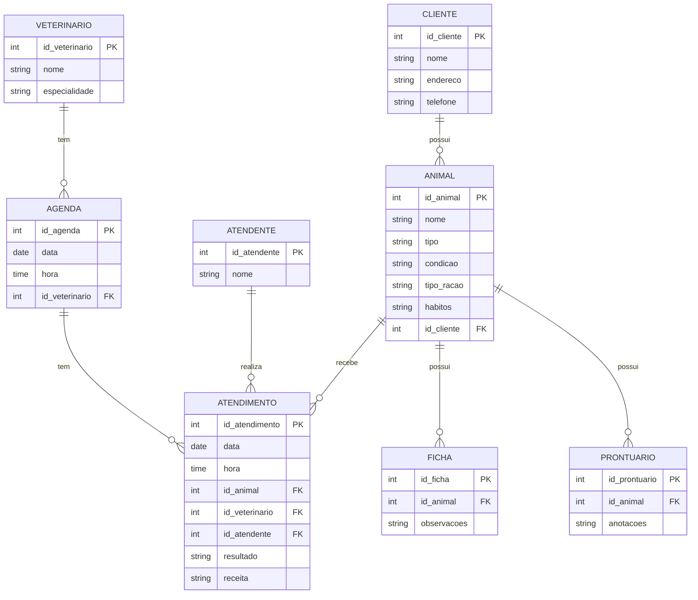
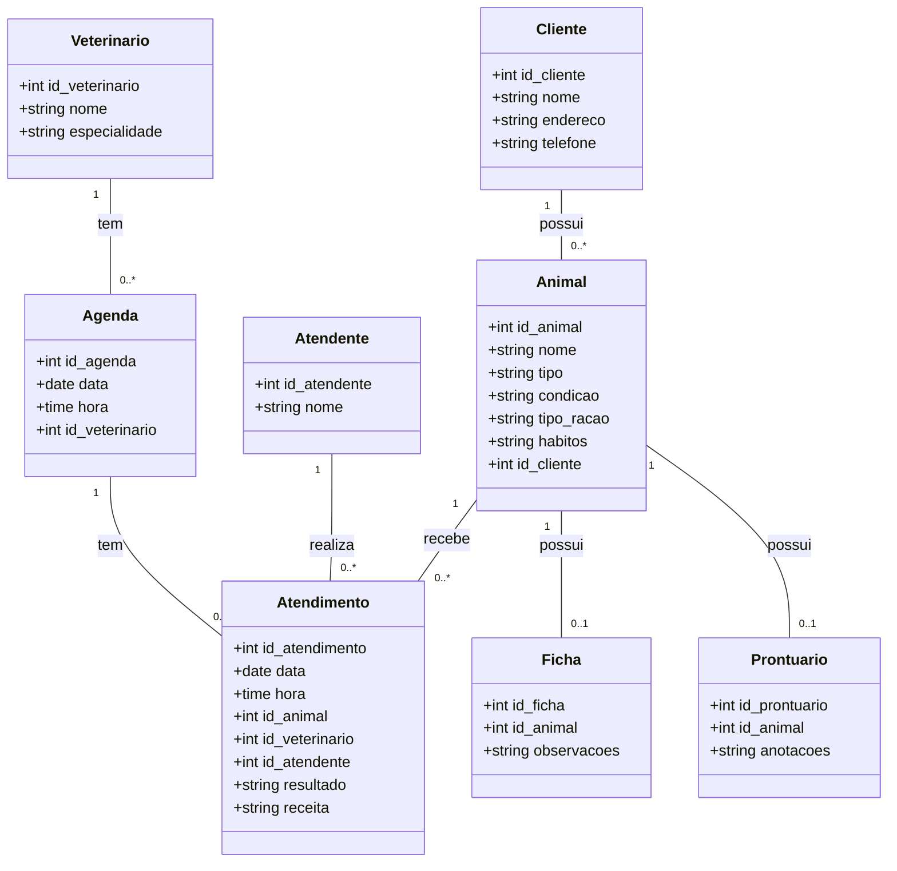
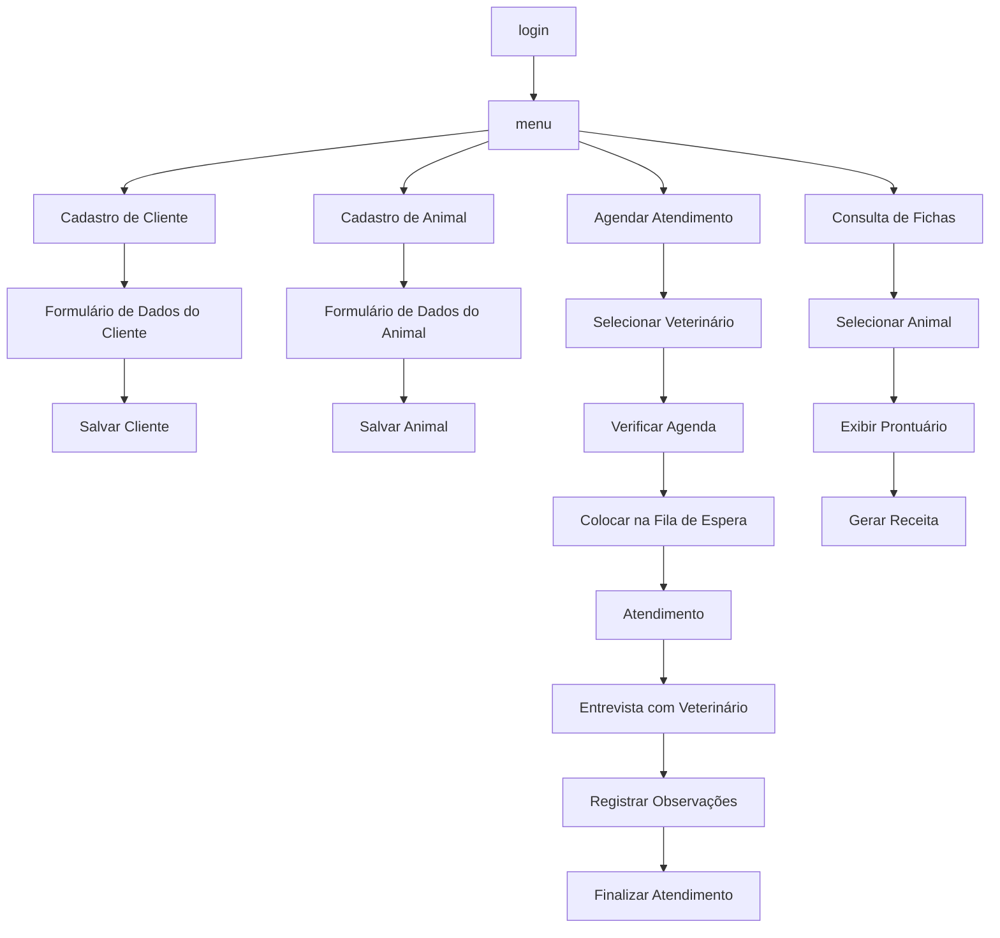
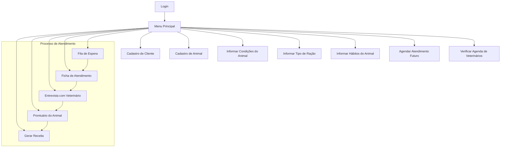

# Projeto exemplo para Engenharia de Software

Repositório usado nas disciplinas de:
a) Engenharia de Software e,
b) Modelagem e projeto de banco de dados.

---
# Sumário


- [Projeto exemplo para Engenharia de Software](#projeto-exemplo-para-engenharia-de-software)
- [Sumário](#sumário)
- [1. Introdução](#1-introdução)
  - [1.1. Contexto](#11-contexto)
- [2. Descrição do negócio](#2-descrição-do-negócio)
  - [2.1. Definições](#21-definições)
- [3. Requisitos](#3-requisitos)
  - [3.1. Requisitos Funcionais e Não Funcionais](#31-requisitos-funcionais-e-não-funcionais)
- [3. Visão geral do sistema](#3-visão-geral-do-sistema)
- [4. Diagrama ER](#4-diagrama-er)
  - [4.1 Descrição das Entidades e Relacionamentos](#41-descrição-das-entidades-e-relacionamentos)
  - [4.2 Relacionamentos](#42-relacionamentos)
- [5. Diagrama de classe](#5-diagrama-de-classe)
  - [5.1. Descrição das Classes e Relacionamentos](#51-descrição-das-classes-e-relacionamentos)
  - [5.2. Relacionamentos](#52-relacionamentos)
- [6. Casos de uso](#6-casos-de-uso)
  - [6.1. Casos de uso](#61-casos-de-uso)
  - [6.2. Histórias de usuário](#62-histórias-de-usuário)
    - [6.2.1. História de Usuário 1: Cadastro de Cliente](#621-história-de-usuário-1-cadastro-de-cliente)
    - [6.2.2. História de Usuário 2: Cadastro de Animal](#622-história-de-usuário-2-cadastro-de-animal)
    - [6.2.3. História de Usuário 3: Informar Condições e Hábitos do Animal](#623-história-de-usuário-3-informar-condições-e-hábitos-do-animal)
    - [6.2.4. História de Usuário 4: Informar Tipo de Ração](#624-história-de-usuário-4-informar-tipo-de-ração)
    - [6.2.5. História de Usuário 5: Marcar Atendimento Futuro](#625-história-de-usuário-5-marcar-atendimento-futuro)
    - [6.2.6. História de Usuário 6: Atendimento pelo Atendente](#626-história-de-usuário-6-atendimento-pelo-atendente)
    - [6.2.7. História de Usuário 7: Entrevista e Exame pelo Veterinário](#627-história-de-usuário-7-entrevista-e-exame-pelo-veterinário)
    - [6.2.8. História de Usuário 8: Gerar Receita](#628-história-de-usuário-8-gerar-receita)
    - [6.2.9. História de Usuário 9: Criar Ficha e Prontuário](#629-história-de-usuário-9-criar-ficha-e-prontuário)
    - [6.2.10. História de Usuário 10: Acesso às Informações de Atendimento](#6210-história-de-usuário-10-acesso-às-informações-de-atendimento)
- [7. Diagrama de componentes](#7-diagrama-de-componentes)
- [8. Diagrama de implantação](#8-diagrama-de-implantação)
- [9. Diagramas C4](#9-diagramas-c4)
  - [9.1. Diagrama de contexto](#91-diagrama-de-contexto)
  - [9.2. Diagrama de container](#92-diagrama-de-container)
  - [9.3. Diagrama de componente](#93-diagrama-de-componente)
  - [9.4. Diagrama de código](#94-diagrama-de-código)
- [9. Protótipo de telas](#9-protótipo-de-telas)
- [10. Diagrama de navegação de telas](#10-diagrama-de-navegação-de-telas)
  - [10.1. Exemplo 1](#101-exemplo-1)
  - [10.2.  Exemplo 2](#102--exemplo-2)
  - [10.3. Editado manualmente](#103-editado-manualmente)
  - [10.4. Segunda geração do diagrama](#104-segunda-geração-do-diagrama)
- [11. Pilha tecnológica](#11-pilha-tecnológica)
  - [11.1. segunda versão](#111-segunda-versão)
- [12. Requisitos de sistemas](#12-requisitos-de-sistemas)
  - [12.1. Requisitos do lado cliente](#121-requisitos-do-lado-cliente)
  - [12.2. Requisitos do lado servidor](#122-requisitos-do-lado-servidor)
- [13. Considerações sobre segurança](#13-considerações-sobre-segurança)
  - [13.1. Lado cliente](#131-lado-cliente)
  - [13.2. Lado servidor](#132-lado-servidor)
- [14. Manutenção, instalação e Novas funcionalidades](#14-manutenção-instalação-e-novas-funcionalidades)
  - [14.1. instalado no lado servidor](#141-instalado-no-lado-servidor)
  - [14.2. Manutenção](#142-manutenção)
  - [14.3. Novas funcionalidades](#143-novas-funcionalidades)
- [15. Treinamento](#15-treinamento)
  - [15.1. usuário](#151-usuário)
  - [15.2. admin](#152-admin)
- [16. Script SQL](#16-script-sql)
  - [16.1. Comandos CREATE table](#161-comandos-create-table)
  - [16.2. Comandos INSERT gerando dados fictícios](#162-comandos-insert-gerando-dados-fictícios)
    - [16.2.1. Explicação dos dados fictícios](#1621-explicação-dos-dados-fictícios)


---
# 1. Introdução

> [!IMPORTANT]  
> O projeto a seguir é um exercício para discussão em sala de aula.
> O projeto atende uma petshop/clínica veterinária.

## 1.1. Contexto 

A empresa é considerada "micro empresa" e iniciou as atividades recentemente. Ao possuir serviços exclusivos, os sistemas presentes no mercado não se enquadrão em suas necessidades, desta forma, os proprietários decidiram desenvolver uma solução própria. Esta solução é detalhada a seguir:

---
# 2. Descrição do negócio

Descrição do cenário onde o sistema deverá funcionar e funcionalidades:

> [!Importante]  
> Considere que esta lista foi elabora conforme o usuário ia comentando.

1. Uma Petshop e clínica veterinária atende apenas os animais: gatos e cachorros. 
2. Os clientes devem fazer um cadastro de si (nome do responsável, telefone, email, endereço) e dos animais. 
3. Os clientes devem informar as condições (se esta bem de saúde, o que tem comido, sono, etc) nas quais os animais chegam.
4. Os clientes devem informar o tipo de ração que o animal come. 
5. Os clientes devem informar hábitos do animal (quando dorme, quando come, se faz exercícios, se já teve cirurgias, etc). 
6. Para cada animal é possível que mais de um veterinário. 
7. Os animais podem chegar e serem atendidos de acordo com uma agenda do dia. 
8. Cada animal atendido receberá uma ficha ou cadastro (a ficha irá conter dados como: nome do responsável, apelido, raça, sexo, altura, peso, cor principal, idade aproximada, data de nascimento) e um prontuário (que irá conter: datas de vacinação, vacinas aplicadas, tratamentos médicos, remédios que esta tomando, vacinas contra raiva). 
9. Os clientes podem querer marcar horários de atendimento futuro, na forma de agendamento. 
10. Cada atendimento gera uma receita para o animal. 
11.	Quando um cliente chega na clínica veterinária ele é atendido por um atendente. 
12.	O atendente deve verificar se existe agenda disponível com um veterinário. 
13.	O atendente deve colocar o cliente e seu animal na fila de espera, se for o caso. 
14.	O atendente deve levar o cliente e o animal até o veterinário. 
15.	O veterinário deve realizar uma entrevista com o dono do animal. 
16.	O resultado da entrevista deve alimenta dados no cadastro ou ficha do animal e no prontuário. 
17.	O veterinário deverá examinar o animal e anotar em um prontuário suas observações. 
18.	Dependendo da situação do animal, ele poderá receberá uma receita com medicamentos ou vacinas.
19.	A clínica pode realizar cirurgias de pequeno porte nos animais.
20.	A clínica também vende rações especiais para tratamento de cães e gatos.
21.	A clínica também oferece serviço de hospedagem por até uma semana.
22.	A clínica oferece serviço de hospedagem se houver agendamento prévio e disponibilidade na agenda da hospedagem.
23.	A clínica oferece serviços de limpeza, banho e tosa dos cães e gatos.
24. A clíniva se comunica com os clientes via aplicativos de mensagens whatsapp e telegram.
25. A clínica usa os aplicativos de mensagens para realizar os agendamentos de atendimento médico, limpeza e hospedagem.
26. A clínica usar o seu sistema interno para enviar uma notificiação para os donos dos animais que o serviço terminou, esta notificação deve ser por duas vias email e aplicativo de mensagens.
27. A clínica deve ter no seu controle um sistema de caixa, com os registros dos recebimentos diários.
28. A clínica deve ter um sistema de contas a pagar e receber, indicando em tabelas separadas os valores entrantes e despesas pagas.
29. A clínica emite uma nota fiscal de serviço para os serviços e um cupom fiscal para os produtos da petshop.
30. A petshop tem apenas um atendente. A clínica tem um atendente para limpeza dos animais, um atendente na recepção e um médico veteriário.

> [!Importante]  
> Considere que esta lista foi elabora conforme o usuário ia comentando.


> :memo: **Dica:** Adicione características a mais na relação acima para personalizar seu projeto.


## 2.1. Definições

Prontuário: é um documento que consta a história de atendimento, é elabora pelo veterinário.

> :memo: **Dica:** Crie uma seção com definições para ajudar outros a compreenderem os termos usados no projeto!


# 3. Requisitos

## 3.1. Requisitos Funcionais e Não Funcionais

| **Categoria**                  | **Requisito**                                                                                                                                                  |
|---------------------------------|----------------------------------------------------------------------------------------------------------------------------------------------------------------|
| **Requisitos Funcionais**      | 1. A clínica veterinária atende apenas gatos e cachorros.                                                                                                      |
|                                 | 2. Os clientes devem fazer um cadastro de si e dos animais.                                                                                                   |
|                                 | 3. Os clientes devem informar as condições nas quais os animais chegam.                                                                                       |
|                                 | 4. Os clientes devem informar o tipo de ração que o animal come.                                                                                             |
|                                 | 5. O cliente deve informar os hábitos do animal.                                                                                                              |
|                                 | 6. Para cada animal, mais de um veterinário pode realizar o atendimento.                                                                                      |
|                                 | 7. Os animais podem chegar e serem atendidos de acordo com uma agenda do dia.                                                                                |
|                                 | 8. Cada animal atendido receberá uma ficha e um prontuário.                                                                                                   |
|                                 | 9. Outros donos podem querer marcar horários de atendimento futuro.                                                                                            |
|                                 | 10. O atendimento gera uma receita para o animal.                                                                                                             |
|                                 | 11. Quando um cliente chega na clínica veterinária, ele é atendido por um atendente.                                                                          |
|                                 | 12. O atendente deve verificar se existe agenda disponível com um veterinário.                                                                                |
|                                 | 13. O atendente deve colocar o cliente e seu animal na fila de espera, se necessário.                                                                        |
|                                 | 14. O atendente deve levar o cliente e o animal até o veterinário.                                                                                            |
|                                 | 15. O veterinário deve realizar uma entrevista com o dono do animal.                                                                                         |
|                                 | 16. O resultado da entrevista deve ser registrado em um formulário.                                                                                            |
|                                 | 17. O veterinário deverá examinar o animal e anotar suas observações no prontuário (ficha).                                                                  |
|                                 | 18. Dependendo da situação do animal, este receberá uma receita.                                                                                             |
| **Requisitos Não Funcionais**  | 1. O sistema deve ser acessível a partir de dispositivos móveis (responsivo).                                                                                 |
|                                 | 2. O sistema deve ser seguro, protegendo os dados pessoais dos clientes e os históricos dos animais.                                                         |
|                                 | 3. O sistema deve ser capaz de lidar com múltiplos atendimentos simultaneamente.                                                                               |
|                                 | 4. O sistema deve permitir que as informações sejam facilmente atualizadas, como as condições do animal e a agenda do veterinário.                           |
|                                 | 5. O tempo de resposta do sistema não deve exceder 5 segundos para a maioria das operações.                                                                  |
|                                 | 6. O sistema deve ser intuitivo e fácil de usar para atendentes e veterinários, com uma interface amigável.                                                   |
|                                 | 7. O sistema deve ser compatível com as versões mais recentes dos navegadores web.                                                                          |
|                                 | 8. O sistema deve ter backup regular para garantir a recuperação de dados em caso de falha.                                                                 |
|                                 | 9. O sistema deve ser capaz de gerar relatórios de atendimentos e receitas de forma automática.                                                              |
|                                 | 10. O sistema deve ser escalável, permitindo a adição de novos veterinários, atendentes e clientes sem comprometer o desempenho.                              |


---
# 3. Visão geral do sistema


> :memo: **Dica:** Descreva o que o sistema entrega do ponto de vista do usuário final. 


---
# 4. Diagrama ER


> :memo: **Dica:** O diagrama ER é importante neste projeto porque... 1) Permite a visualização clara da estrutura de dado. 2) Facilita a comunicação entre a equipe, entre os devs. 3) É a base para o projeto do banco de dados. 4) Permite a identificação de possíveis problemas de projeto.




> :warning: **Atenção:** Repare que os código gerados por ferramentas poderão conter erros! Veja os casos dos atributos "resultados" e "receita", poderiam ter sido modelados de outra forma.

[Voltar ao Início](#repositório_projeto_eng_sw)

[início](#sumário)

## 4.1 Descrição das Entidades e Relacionamentos

> :memo: **Dica:** Esta relação é um simplificação das entidades e seus relacionamentos, serve como um princípio para a elaboração de um dicionário de dados.

- **CLIENTE**: Contém informações sobre os clientes da clínica.
- **ANIMAL**: Contém informações sobre os animais que pertencem aos clientes.
- **VETERINARIO**: Contém informações sobre os veterinários.
- **ATENDENTE**: Contém informações sobre os atendentes.
- **AGENDA**: Contém informações sobre horários disponíveis para atendimento.
- **ATENDIMENTO**: Registra os atendimentos realizados para os animais.
- **FICHA**: Contém observações feitas pelo veterinário durante o atendimento.
- **PRONTUARIO**: Contém anotações adicionais feitas pelo veterinário.

## 4.2 Relacionamentos

- **CLIENTE** pode ter vários **ANIMAL**s.
- **ANIMAL** pode receber vários **ATENDIMENTO**s.
- **VETERINARIO** pode ter várias **AGENDA**s.
- **AGENDA** pode ter vários **ATENDIMENTO**s.
- **ATENDENTE** pode realizar vários **ATENDIMENTO**s.
- **ANIMAL** pode ter uma **FICHA**.
- **ANIMAL** pode ter um **PRONTUARIO**.


[Voltar ao Início](#repositório_projeto_eng_sw)


---
# 5. Diagrama de classe


> :memo: **Dica:** O diagrama de classes é importante neste projeto porque... 1) Modela a estrutura do sistema. 2) Facilita a comunicação entre os devs. 3) Organiza a lógica do negócio pois diferente do modelo ER, este diagrama poderá ter uma relação de métodos. 4) Ajuda na reutilização de código. 




> :warning: **Atenção:** Repare que os código gerados por ferramentas poderão conter erros! Como este diagrama foi gerado a partir do diagrama ER anterior, apresenta os mesmos problemas. Note que a ferramenta não detectou na descrição do negócio métodos significativos para representá-los neste diagrama.

[Voltar ao Início](#repositório_projeto_eng_sw)

## 5.1. Descrição das Classes e Relacionamentos

- **Cliente**: Contém informações sobre os clientes da clínica. Um cliente pode ter vários animais.
- **Animal**: Contém informações sobre os animais, como nome, tipo, condição, tipo de ração e hábitos. Um animal pode receber vários atendimentos.
- **Veterinario**: Contém informações sobre os veterinários, como nome e especialidade. Um veterinário pode ter várias agendas.
- **Atendente**: Contém informações sobre os atendentes da clínica. Um atendente pode realizar vários atendimentos.
- **Agenda**: Contém informações sobre os horários disponíveis para atendimento. Cada agenda está associada a um veterinário e pode ter vários atendimentos.
- **Atendimento**: Registra os atendimentos realizados, incluindo data, hora, resultados e receitas. Cada atendimento está associado a um animal, um veterinário e um atendente.
- **Ficha**: Contém observações feitas pelo veterinário durante o atendimento. Cada animal pode ter uma ficha.
- **Prontuario**: Contém anotações adicionais feitas pelo veterinário. Cada animal pode ter um prontuário.

## 5.2. Relacionamentos

- **Cliente** pode ter vários **Animal**s.
- **Animal** pode ter vários **Atendimento**s.
- **Veterinario** pode ter várias **Agenda**s.
- **Agenda** pode ter vários **Atendimento**s.
- **Atendente** pode realizar vários **Atendimento**s.
- **Animal** pode ter uma **Ficha**.
- **Animal** pode ter um **Prontuario**.


---
# 6. Casos de uso

> :memo: **Dica:** O diagrama casos de uso é importante neste projeto porque... 1) Define os requisitos funcionais e seus personagens. 2) Facilita a comunicação com stakeholders, usuários da área de negócio podem entender este diagrama. 3) Identifica os atores e suas interações em cada módulo do sistema. 4) Ajuda a priorizar funcionalidades, pois o usuário pode decidir qual caso de uso ele acha mais importante desenvolver primeiro. 5) Os balões nos casos de uso poderão se transformar em códigos no sistema. 

[Voltar ao Início](#repositório_projeto_eng_sw)

## 6.1. Casos de uso

:bulb: **Dica:** Crie diagramas com situações de utilização do sistema.


[Voltar ao Início](#repositório_projeto_eng_sw)

## 6.2. Histórias de usuário


:bulb: **Dica:** Histórias de usuários são importantes no projeto técnico porque... 1) Foco nas necessidades do usuário. 2) Facilitam a comunicação com a equipe (lembrando que equipes crum tem 3 personagens!!). 3) Promovem entregas incrementais (cada entrega por ser uma entrega). 4) Facilitam a definição de critérios de aceitação (o usuário especifica o que ele considera como critério para dizer que um módulo esta pronto para entrega). 5) É uma ferramenta mais próxima da realidade do usuário. 6) Histórias de usuário não fazem parte da UML, é um texto!

[Voltar ao Início](#repositório_projeto_eng_sw)

### 6.2.1. História de Usuário 1: Cadastro de Cliente

```
**Como** um novo cliente,  
**Quero** cadastrar minhas informações pessoais na clínica veterinária,  
**Para que** eu possa ser identificado e contatado pela clínica quando necessário.

**Critérios de Aceitação:**
- O cliente pode inserir seu nome, endereço e telefone.
- O sistema deve armazenar essas informações e associá-las ao cliente.
```


### 6.2.2. História de Usuário 2: Cadastro de Animal

```
**Como** um cliente,  
**Quero** cadastrar meus animais na clínica,  
**Para que** eu possa acompanhar os atendimentos e necessidades de cada um.

**Critérios de Aceitação:**
- O cliente pode inserir o nome, tipo (gato ou cachorro), condição, tipo de ração e hábitos do animal.
- O sistema deve associar o animal ao cliente que o cadastrou.
```


### 6.2.3. História de Usuário 3: Informar Condições e Hábitos do Animal

```
**Como** um cliente,  
**Quero** informar as condições nas quais meu animal chega e seus hábitos,  
**Para que** o veterinário tenha informações completas sobre o estado do animal.

**Critérios de Aceitação:**
- O cliente pode adicionar informações sobre a condição e hábitos do animal durante o cadastro ou na atualização do perfil do animal.
- Essas informações devem ser armazenadas no perfil do animal.
```

### 6.2.4. História de Usuário 4: Informar Tipo de Ração

```
**Como** um cliente,  
**Quero** informar o tipo de ração que meu animal come,  
**Para que** o veterinário possa considerar isso durante o atendimento.

**Critérios de Aceitação:**
- O cliente pode adicionar o tipo de ração que o animal consome.
- O sistema deve armazenar essa informação e associá-la ao perfil do animal.
```


### 6.2.5. História de Usuário 5: Marcar Atendimento Futuro

```
**Como** um cliente,  
**Quero** marcar horários de atendimento futuros para meu animal,  
**Para que** eu possa garantir que meu animal será atendido quando necessário.

**Critérios de Aceitação:**
- O cliente pode solicitar uma marcação de horário para atendimento futuro.
- O sistema deve verificar a disponibilidade na agenda dos veterinários e confirmar a marcação.
```


### 6.2.6. História de Usuário 6: Atendimento pelo Atendente

```
**Como** um cliente,  
**Quero** ser atendido por um atendente ao chegar na clínica,  
**Para que** eu possa ser direcionado adequadamente e verificar a disponibilidade de horários para atendimento.

**Critérios de Aceitação:**
- O atendente deve verificar a disponibilidade de horários com os veterinários.
- O atendente deve colocar o cliente e o animal na fila de espera, se necessário, e direcioná-los ao veterinário.
```


### 6.2.7. História de Usuário 7: Entrevista e Exame pelo Veterinário

```
**Como** um veterinário,  
**Quero** realizar uma entrevista com o dono do animal e examinar o animal,  
**Para que** eu possa entender o estado do animal e registrar minhas observações.

**Critérios de Aceitação:**
- O veterinário deve poder registrar as observações durante a entrevista e o exame.
- O resultado da entrevista deve ser registrado em um formulário.
- As observações do exame devem ser anotadas no prontuário do animal.
```


### 6.2.8. História de Usuário 8: Gerar Receita

```
**Como** um veterinário,  
**Quero** gerar uma receita para o animal,  
**Para que** o cliente possa seguir as recomendações de tratamento.

**Critérios de Aceitação:**
- O veterinário deve poder registrar uma receita para o animal, se necessário.
- A receita deve ser vinculada ao atendimento e disponível para o cliente.
```


### 6.2.9. História de Usuário 9: Criar Ficha e Prontuário

```
**Como** um veterinário,  
**Quero** criar uma ficha e um prontuário para o animal atendido,  
**Para que** haja um registro completo das observações e tratamentos recomendados.

**Critérios de Aceitação:**
- O veterinário deve poder criar e associar uma ficha ao animal.
- O prontuário deve conter todas as anotações e observações do atendimento.
```


### 6.2.10. História de Usuário 10: Acesso às Informações de Atendimento

```
**Como** um cliente,  
**Quero** acessar as informações de atendimento e registros de meus animais,  
**Para que** eu possa acompanhar o histórico de atendimentos e recomendações.

**Critérios de Aceitação:**
- O cliente deve poder visualizar o histórico de atendimentos, fichas e prontuários dos seus animais.
- As informações devem estar organizadas e acessíveis na interface do cliente.
```
[Voltar ao Início](#repositório_projeto_eng_sw)


---
# 7. Diagrama de componentes


:bulb: **Dica:** Diagramas de componentes são importantes no projeto técnico porque... 1) Visualização da arquitetura do sistema. 2) Explica a modularidade do projeto. 3) Apresenta casos de modularidade dos componentes do sistema. 4) Permite identificar peças críticas do projeto.


[Voltar ao Início](#repositório_projeto_eng_sw)


---
# 8. Diagrama de implantação


:bulb: **Dica:** Diagramas de implantação são importantes no projeto técnico porque... 1) Permite visualizar o planejamento de instalação do sistema no parque de máquinas. 2) Permite identificar hardwa e software que serão necessários adquirir e organizar. 3) Ajuda no projeto de infra e segurança de rede. 4) Possibilida a visualização do parque computacional (incluindo hardware e software). 5) Permite identificar qual componente de software estará instalado em qual nó.


[Voltar ao Início](#repositório_projeto_eng_sw)

---
# 9. Diagramas C4


## 9.1. Diagrama de contexto

```
cole aqui !
```

## 9.2. Diagrama de container


## 9.3. Diagrama de componente


## 9.4. Diagrama de código


---
# 9. Protótipo de telas

:bulb: **Dica:** É uma etapa importante do projeto porque: 1) Permite a visualização clara do design (UX/IX) e sua representação visual do que será entregue em diferentes formatos até a utilização dos controles (visuais) reais para o usuário testar a tela. 2) Facilitam ajustes antecipados: Com protótipos é possível testar antes de "entrar em produção". 3) Permite que o usuário possa "se manifestar" antecipadamente para a equipe e comentar o que deseja e o que deve conter ou não nos formulários. 4) Testam a experiência do usuário quanto a velocidade de acesso, facilidade de uso, compreensão do que deve fazer nas telas e o que deve acionar. 5) Auxiliam na definição de requisitos técnicos que ainda não foram percebidos pelos Devs.


:bulb: **Dica:** Diferenças entre Wireframe x Mockup x Prototipação... 

| Wireframe  | Mockup | Prototipo |
| ------------- | ------------- | ------- |
| Mostra estrutura de blocos, pode ser considerado um esqueleto do projeto | Apresenta cores, estipo visual e tipografia de fontes | Mais perto da versão final |
| Desenho de interface básico  | Testes de responsividade, tem conteúdo estático | Permite simular interação com o usuário, pois pode conter dados |
| Barato  | Melhorar usuário dar um feedback | Pode ter partes clicáveis e mostrar dados fictícios |
| Criado em curto espaço de tempo | Pode levar mais tempo para ficar pronto | Demorar mais tempo devido a complexidade de interações dentro do protótipo |
| Pode ser uma desenho no papel, representação de baixa qualidade e fidelidade  | Apresenta especto visual perto do final | Poderá ser reaproveitado |
| $  | $$ | $$$ |
| Exemplos de softwares: Balsamiq, Adobe XD, Evolus, UXpin  | Exemplos de software: InVision, Moqups, Photoshop, Evolus | Exemplos de softwares: FlutterFlow, Mockplus, Adobe XD, Android Studio, Embarcadero Delphi, MS Xamarin, Scriptcase. |

[Voltar ao Início](#repositório_projeto_eng_sw)


---
# 10. Diagrama de navegação de telas


:bulb: **Dica:** São importantes porque: 1) Permitem a visualização do fluxo do usuário, mostrando o caminho que o usuário deve percorrer ao utilizar o sistema. 2) Facilitam o design da interface, ajudam o PO e o Dev a alterar componentes (controles visuais) durante as Sprints. 3) Uma variação do item 2, é que a equipe toda tem uma visão geral da navegação entre interfaces (formulários) com o usuário. Inclusive os stakeholders. 4) Possibilita identificar fluxos quebrados ou incompletos e telas "perdidas" no sistema. 5) Permite o suporte à usabilidade e acessibilidade auxiliam a visualização e fluxo de navegação seja acessível para todos.


## 10.1. Exemplo 1


[Voltar ao Início](#repositório_projeto_eng_sw)

## 10.2.  Exemplo 2


> :warning: **Atenção:** Veja diferença entre os diagramas acima e o que a ferrementa de IA produziu abaixo! Dependendo da complexidade e quantidade de formulários uma abordagem contendo apenas os nomes de formulários pode reduzir signficativamente o espaço dos diagramas nos projetos. 

> :warning: **Atenção:** Diagramas gerados por IA podem conter erros, veja o caso abaixo temos um form chamado "entrevista com veterinário", entre outros. 


## 10.3. Editado manualmente

> :warning: **Atenção:** Neste diagrama tivemos que alterar o código gerado para conter a tela de login, a IA não levou em consideração esse formulário ou não estava na especificação que foi passada.




[Voltar ao Início](#repositório_projeto_eng_sw)

## 10.4. Segunda geração do diagrama

> :warning: **Atenção:** Neste diagrama tivemos que alterar o código gerado para conter a tela de login, a IA não levou em consideração esse formulário ou não estava na especificação que foi passada.



[Voltar ao Início](#repositório_projeto_eng_sw)


---
# 11. Pilha tecnológica

```mermaid

graph TD;
    A[Pilha Tecnológica do Sistema Web] --> B[Servidor Web]
    A --> C[Linguagem de Programação]
    A --> D[Sistema de Gerenciamento de Banco de Dados]
    A --> E[Ambiente de Desenvolvimento]
    A --> F[Controle de Versão]
    A --> G[Frameworks e Bibliotecas]
    A --> H[Segurança]
    A --> I[Testes]
    A --> J[Gerenciamento de Dependências]
    A --> K[Documentação]
    
    B --> B1[Apache HTTP Server]
    B --> B2[XAMPP/WAMP/MAMP]

    C --> C1[PHP]
    
    D --> D1[MySQL]
    D --> D2[MySQL Workbench]
    D --> D3[phpMyAdmin]

    E --> E1[Visual Studio Code]
    E --> E2[Sublime Text]
    E --> E3[PHPStorm]

    F --> F1[Git]
    F --> F2[GitHub]
    F --> F3[GitLab]
    F --> F4[Bitbucket]

    G --> G1[Laravel]
    G --> G2[CodeIgniter]
    G --> G3[Bootstrap]

    H --> H1[SSL/TLS]
    H --> H2[Let’s Encrypt]

    I --> I1[PHPUnit]
    I --> I2[Postman]

    J --> J1[Composer]

    K --> K1[Markdown]
```


:bulb: **Dica:** Esta parte do projeto técnico é importante porque: 1) Permite que o projeto seja compatível com os requisitos técnicos e com as funcionalidades esperados pelo usuário. 2) Possibilita que equipamentos e software sejam especificados antecipadamente possibilitando estudo prévio sobre custo, desempenho e escalabilidade. 3) Possibilitará futuras operações de manutenção. 4) Poderá ajudar na definição de requisitos de segurança e velocidade. 5) Permite que seja feita uma projeção e planejamento de compatibilidade tecnológica na fase de projeto com o que existe atualmente na estrutura da empresa.



[Voltar ao Início](#repositório_projeto_eng_sw)

## 11.1. segunda versão

```mermaid
graph TD;
    A[Pilha Tecnológica] --> B[Frontend]
    A --> C[Backend]
    A --> D[Banco de Dados]
    A --> E[Servidor Web]
    A --> F[Segurança]
    A --> G[Ambiente de Desenvolvimento]
    
    %% Frontend Details
    B --> B1[HTML/CSS/JavaScript]
    B --> B2[Bootstrap]
    B --> B3[Formulários de Cadastro e Atendimento]

    %% Backend Details
    C --> C1[PHP]
    C --> C2[Framework PHP]
    C --> C3[Componentes do Sistema]
    C1 --> C4[Gerenciamento de Sessões]
    C1 --> C5[Validação de Formulários]
    C3 --> C6[Cadastro de Cliente e Animal]
    C3 --> C7[Atendimentos e Prontuários]
    C3 --> C8[Controle de Agendas e Fila de Espera]

    %% Database Details
    D --> D1[MySQL]
    D --> D2[phpMyAdmin/MySQL Workbench]
    D --> D3[Tabelas: Clientes, Animais, Atendimentos, Prontuários, Veterinários]
    
    %% Web Server Details
    E --> E1[Apache HTTP Server]
    E --> E2[XAMPP/WAMP/MAMP]

    %% Security Details
    F --> F1[SSL/TLS]
    F --> F2[Let’s Encrypt]
    F --> F3[Autenticação de Usuários]

    %% Development Environment Details
    G --> G1[Visual Studio Code/Sublime Text/PHPStorm]
    G --> G2[Git]
    G --> G3[GitHub/GitLab/Bitbucket]
    G --> G4[Composer]
    G --> G5[PHPUnit para Testes]

```




[Voltar ao Início](#repositório_projeto_eng_sw)


---
# 12. Requisitos de sistemas

:bulb: **Dica:** É uma parte importante do projeto técnico porque: 1) permite projetar o mínimo requisito de hardware e software necessário para que o software possa funcionar com desempenho satisfatório. 2) Permitirá explicitar ao PO detalhes como integração de sistemas. 3) Possibilitará identificar incompatibilidades com softwares que já estão operando hoje. 4) A equipe de suporte saberá antecipadamente que para instalar o software o ambiente deverá ter estes requisitos mínimos para funcionar.

## 12.1. Requisitos do lado cliente

1)

2)

3)


## 12.2. Requisitos do lado servidor

:bulb: **Dica:** Veja o que uma hospedagem web oferece nos planos para hospedar um site !!

1)

2)

3)

[Voltar ao Início](#repositório_projeto_eng_sw)


---
# 13. Considerações sobre segurança

:bulb: **Dica:** Definir previamente requisitos de segurança é um aspecto importante porque: 1) Permite que sejam elaborados funcionalidades e detalhes para proteção de dados sensíveis. 2) Ajuda a prevenir contra ataques cibernéticos. 3) Torna o projeto do software compatível com leis e regulamentos. 4) É uma garantia de que o sistema funcionará de forma correta e íntegra. 5) Possibilita que o PO e os usuários tenha confiança no software. 6) Poderá minimizar prejuízos financeiros.

## 13.1. Lado cliente

Regras de senha
catcha, qtda min. caracteres, caracteres especiais, etc...
autenticação de 2 fatores
recuperação de senha com email
código no email
anti vírus

## 13.2. Lado servidor

Sugerir Linux ou Windows ??

Sugestão ?? Política de backup de aplicação e banco ?? 1x/mês 1 full backup, 1x a cada 15 dias 1 full backup, no final de cada dia um backup incremental

o admin do sistema não acessa dados do usuário!

[Voltar ao Início](#repositório_projeto_eng_sw)


---
# 14. Manutenção, instalação e Novas funcionalidades

:bulb: **Dica:** Nesta parte do projeto poderão estar aqui: 1) detalhes específicos para instalação do software como a instalação em conjunto com outras bibliotecas de terceiros, instalação em lojas de aplicativos. 2) Detalhes de manutenção como operações especiais de monitoração, rodízio de backup, detalhes sobre segurança que devem ser observados com constância, testes de comunicação e alertas que deve ser observados se estão sendo gerados e entregues. 3) É uma ferramenta que auxilia na elaboração do plano de continguência. 4) Detalha procedimentos pós-instalação. 5) Detalha o que deve ser monitorado no lado cliente e servidor, por exemplo a quantidade de logs gerados e seu armazenamento. 6) Poderá ter critérios para backup e restore. 7) detalhar formulários para o usuário solicitar suporte, formas de solicitação de suporte e critérios de atendimento.


## 14.1. instalado no lado servidor 

## 14.2. Manutenção

## 14.3. Novas funcionalidades

1. formalização do pedido
2. cliente não dá palpite em beleza de tela
3. decidir sob 3 critérios:
a) equipe tem tempo ?
b) é economicamente viável ?
c) é tecnológicamente viável ?

[Voltar ao Início](#repositório_projeto_eng_sw)


---
# 15. Treinamento 

:bulb: **Dica:** O projeto do poderá ter critérios indicando o que é importante constar em um treinamento para capacitar o usuário e os administradores do sistema. O projeto de software poderá indicar a necessidade de atenção em determinados procedimentos operacionais de uso, instalação e manutenção que não são tão claros/óbvios e que merecem atenção e treino.

> :warning: **Atenção:** O projeto de software não é material de treinamento !

## 15.1. usuário

1)

2)


## 15.2. admin

1)

2) 

[Voltar ao Início](#repositório_projeto_eng_sw)

---
# 16. Script SQL

> :warning: **Atenção:** No projeto de um software não criamos o banco de dados ainda, pois a fase de projeto é um "visão de futuro"; o exemplo abaixo foi inserido para que exercícios pudessem ser realizados em ferramenta IDE RAD.

> :warning: **Atenção:** Em alguns projetos com necessidades específicas, como prototipar telas e navegação usando o Scriptcase é necessário ter um banco de dados com uma quantidade mínima de tabelas; ou em situações em que o projeto de software irá realizar uma atualização de um software legado, pode ser necessário trazer detalhes técnicos do banco ou outras partes.

[Voltar ao Início](#repositório_projeto_eng_sw)

## 16.1. Comandos CREATE table

```SQL

-- Tabela de Clientes
CREATE TABLE clientes (
    id_cliente INT AUTO_INCREMENT PRIMARY KEY,
    nome VARCHAR(100) NOT NULL,
    endereco VARCHAR(255),
    telefone VARCHAR(20),
    email VARCHAR(100)
);

-- Tabela de Animais (gatos e cachorros)
CREATE TABLE animais (
    id_animal INT AUTO_INCREMENT PRIMARY KEY,
    id_cliente INT,
    nome VARCHAR(100) NOT NULL,
    especie ENUM('Gato', 'Cachorro') NOT NULL,
    idade INT,
    raca VARCHAR(100),
    tipo_racao VARCHAR(100),
    habitos TEXT,
    FOREIGN KEY (id_cliente) REFERENCES clientes(id_cliente)
);

-- Tabela de Veterinários
CREATE TABLE veterinarios (
    id_veterinario INT AUTO_INCREMENT PRIMARY KEY,
    nome VARCHAR(100) NOT NULL,
    especialidade VARCHAR(100),
    telefone VARCHAR(20)
);

-- Tabela de Condições dos Animais
CREATE TABLE condicoes (
    id_condicao INT AUTO_INCREMENT PRIMARY KEY,
    descricao TEXT NOT NULL
);

-- Tabela de Atendimento
CREATE TABLE atendimentos (
    id_atendimento INT AUTO_INCREMENT PRIMARY KEY,
    id_animal INT,
    id_cliente INT,
    id_veterinario INT,
    data_atendimento DATETIME NOT NULL,
    condicao_animal INT,
    ficha TEXT,
    prontuario TEXT,
    receita TEXT,
    FOREIGN KEY (id_animal) REFERENCES animais(id_animal),
    FOREIGN KEY (id_cliente) REFERENCES clientes(id_cliente),
    FOREIGN KEY (id_veterinario) REFERENCES veterinarios(id_veterinario),
    FOREIGN KEY (condicao_animal) REFERENCES condicoes(id_condicao)
);

-- Tabela de Agenda
CREATE TABLE agendas (
    id_agenda INT AUTO_INCREMENT PRIMARY KEY,
    id_veterinario INT,
    id_animal INT,
    data_horario DATETIME NOT NULL,
    status ENUM('Agendado', 'Concluído', 'Cancelado') NOT NULL DEFAULT 'Agendado',
    FOREIGN KEY (id_veterinario) REFERENCES veterinarios(id_veterinario),
    FOREIGN KEY (id_animal) REFERENCES animais(id_animal)
);

-- Tabela de Atendentes
CREATE TABLE atendentes (
    id_atendente INT AUTO_INCREMENT PRIMARY KEY,
    nome VARCHAR(100) NOT NULL,
    telefone VARCHAR(20)
);

-- Tabela de Fila de Espera
CREATE TABLE fila_espera (
    id_fila INT AUTO_INCREMENT PRIMARY KEY,
    id_cliente INT,
    id_animal INT,
    id_atendente INT,
    id_veterinario INT,
    data_entrada DATETIME NOT NULL,
    status ENUM('Aguardando', 'Atendido', 'Cancelado') NOT NULL DEFAULT 'Aguardando',
    FOREIGN KEY (id_cliente) REFERENCES clientes(id_cliente),
    FOREIGN KEY (id_animal) REFERENCES animais(id_animal),
    FOREIGN KEY (id_atendente) REFERENCES atendentes(id_atendente),
    FOREIGN KEY (id_veterinario) REFERENCES veterinarios(id_veterinario)
);

-- Tabela de Entrevista (formulário preenchido pelo veterinário)
CREATE TABLE entrevistas (
    id_entrevista INT AUTO_INCREMENT PRIMARY KEY,
    id_atendimento INT,
    observacoes TEXT,
    FOREIGN KEY (id_atendimento) REFERENCES atendimentos(id_atendimento)
);
```
[Voltar ao Início](#repositório_projeto_eng_sw)

## 16.2. Comandos INSERT gerando dados fictícios

```SQL
-- Inserindo clientes
INSERT INTO clientes (nome, endereco, telefone, email) VALUES
('João da Silva', 'Rua A, 123', '11987654321', 'joao.silva@example.com'),
('Maria Oliveira', 'Avenida B, 456', '11987654322', 'maria.oliveira@example.com'),
('Carlos Souza', 'Rua C, 789', '11987654323', 'carlos.souza@example.com');

-- Inserindo animais
INSERT INTO animais (id_cliente, nome, especie, idade, raca, tipo_racao, habitos) VALUES
(1, 'Rex', 'Cachorro', 5, 'Labrador', 'Ração Premium', 'Corre todos os dias'),
(2, 'Mimi', 'Gato', 3, 'Persa', 'Ração Especial', 'Dormir durante o dia'),
(3, 'Bolinha', 'Cachorro', 2, 'Poodle', 'Ração Econômica', 'Brincar com bola');

-- Inserindo veterinários
INSERT INTO veterinarios (nome, especialidade, telefone) VALUES
('Dr. Ana Pereira', 'Clínica Geral', '11987654324'),
('Dr. Pedro Santos', 'Ortopedia', '11987654325'),
('Dra. Carla Lima', 'Dermatologia', '11987654326');

-- Inserindo condições dos animais
INSERT INTO condicoes (descricao) VALUES
('Febre e falta de apetite'),
('Fratura na pata traseira'),
('Coceira excessiva e perda de pelos');

-- Inserindo atendimentos
INSERT INTO atendimentos (id_animal, id_cliente, id_veterinario, data_atendimento, condicao_animal, ficha, prontuario, receita) VALUES
(1, 1, 1, '2024-09-17 10:00:00', 1, 'Animal com febre alta', 'Exame físico realizado. Diagnóstico preliminar: infecção', 'Antibiótico por 7 dias'),
(2, 2, 2, '2024-09-17 11:00:00', 2, 'Fratura detectada na pata traseira', 'Raio-X realizado. Fratura confirmada.', 'Imobilização e repouso'),
(3, 3, 3, '2024-09-17 12:00:00', 3, 'Coceira e irritação na pele', 'Exame dermatológico. Alergia detectada.', 'Corticoide tópico');

-- Inserindo agendas
INSERT INTO agendas (id_veterinario, id_animal, data_horario, status) VALUES
(1, 1, '2024-09-17 10:00:00', 'Concluído'),
(2, 2, '2024-09-17 11:00:00', 'Concluído'),
(3, 3, '2024-09-17 12:00:00', 'Concluído');

-- Inserindo atendentes
INSERT INTO atendentes (nome, telefone) VALUES
('Patrícia Gomes', '11987654327'),
('Lucas Mendes', '11987654328');

-- Inserindo fila de espera
INSERT INTO fila_espera (id_cliente, id_animal, id_atendente, id_veterinario, data_entrada, status) VALUES
(1, 1, 1, 1, '2024-09-17 09:45:00', 'Atendido'),
(2, 2, 2, 2, '2024-09-17 10:30:00', 'Atendido'),
(3, 3, 1, 3, '2024-09-17 11:45:00', 'Atendido');

-- Inserindo entrevistas
INSERT INTO entrevistas (id_atendimento, observacoes) VALUES
(1, 'Dono relata que o animal parou de comer há 2 dias.'),
(2, 'Dono diz que o animal caiu da escada.'),
(3, 'Dono nota que o animal se coça frequentemente nas últimas semanas.');

```

[Voltar ao Início](#repositório_projeto_eng_sw)

### 16.2.1. Explicação dos dados fictícios

* Clientes: João, Maria e Carlos são clientes da clínica, cada um com informações de contato.
* Animais: Rex (cachorro), Mimi (gato) e Bolinha (cachorro) são os animais dos clientes.
* Veterinários: Dr. Ana, Dr. Pedro e Dra. Carla são os veterinários com diferentes especialidades.
* Condições dos animais: Febre, fratura e coceira são exemplos de condições tratadas na clínica.
* Atendimentos: Registros de atendimentos realizados para cada animal, com ficha, prontuário e receita.
* Agendas: Agenda dos veterinários para os animais em horários específicos.
* Atendentes: Patrícia e Lucas são os atendentes responsáveis.
* Fila de espera: Fila de clientes e animais aguardando atendimento.
* Entrevistas: Observações feitas durante a entrevista entre veterinário e dono do animal.

[Voltar ao Início](#repositório_projeto_eng_sw)

