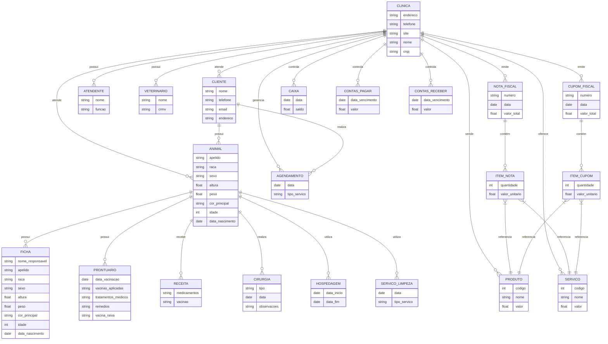
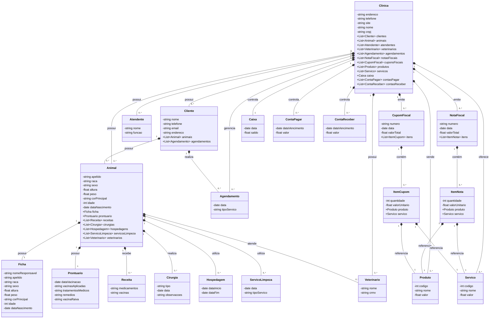
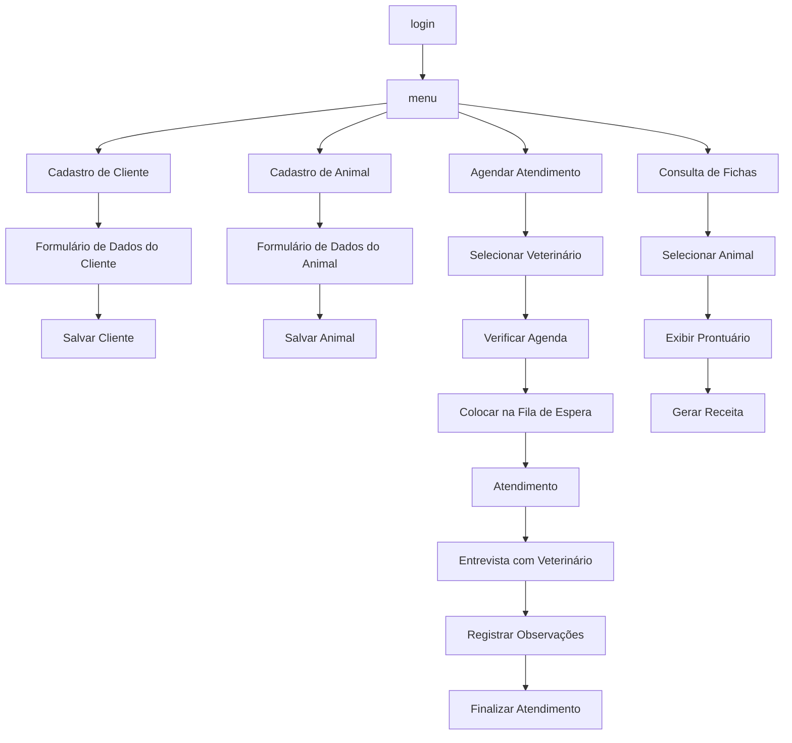
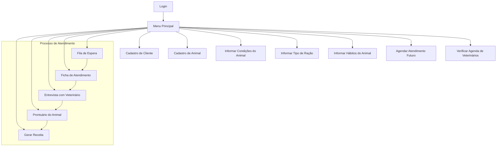

```mermaid

graph TD;
    A[Pilha Tecnológica do Sistema Web] --> B[Servidor Web]
    A --> C[Linguagem de Programação]
    A --> D[Sistema de Gerenciamento de Banco de Dados]
    A --> E[Ambiente de Desenvolvimento]
    A --> F[Controle de Versão]
    A --> G[Frameworks e Bibliotecas]
    A --> H[Segurança]
    A --> I[Testes]
    A --> J[Gerenciamento de Dependências]
    A --> K[Documentação]
    
    B --> B1[Apache HTTP Server]
    B --> B2[XAMPP/WAMP/MAMP]

    C --> C1[PHP]
    
    D --> D1[MySQL]
    D --> D2[MySQL Workbench]
    D --> D3[phpMyAdmin]

    E --> E1[Visual Studio Code]
    E --> E2[Sublime Text]
    E --> E3[PHPStorm]

    F --> F1[Git]
    F --> F2[GitHub]
    F --> F3[GitLab]
    F --> F4[Bitbucket]

    G --> G1[Laravel]
    G --> G2[CodeIgniter]
    G --> G3[Bootstrap]

    H --> H1[SSL/TLS]
    H --> H2[Let’s Encrypt]

    I --> I1[PHPUnit]
    I --> I2[Postman]

    J --> J1[Composer]

    K --> K1[Markdown]
```

```mermaid
graph TD;
    A[Pilha Tecnológica] --> B[Frontend]
    A --> C[Backend]
    A --> D[Banco de Dados]
    A --> E[Servidor Web]
    A --> F[Segurança]
    A --> G[Ambiente de Desenvolvimento]
    
    %% Frontend Details
    B --> B1[HTML/CSS/JavaScript]
    B --> B2[Bootstrap]
    B --> B3[Formulários de Cadastro e Atendimento]

    %% Backend Details
    C --> C1[PHP]
    C --> C2[Framework PHP]
    C --> C3[Componentes do Sistema]
    C1 --> C4[Gerenciamento de Sessões]
    C1 --> C5[Validação de Formulários]
    C3 --> C6[Cadastro de Cliente e Animal]
    C3 --> C7[Atendimentos e Prontuários]
    C3 --> C8[Controle de Agendas e Fila de Espera]

    %% Database Details
    D --> D1[MySQL]
    D --> D2[phpMyAdmin/MySQL Workbench]
    D --> D3[Tabelas: Clientes, Animais, Atendimentos, Prontuários, Veterinários]
    
    %% Web Server Details
    E --> E1[Apache HTTP Server]
    E --> E2[XAMPP/WAMP/MAMP]

    %% Security Details
    F --> F1[SSL/TLS]
    F --> F2[Let’s Encrypt]
    F --> F3[Autenticação de Usuários]

    %% Development Environment Details
    G --> G1[Visual Studio Code/Sublime Text/PHPStorm]
    G --> G2[Git]
    G --> G3[GitHub/GitLab/Bitbucket]
    G --> G4[Composer]
    G --> G5[PHPUnit para Testes]

```

# Projeto exemplo para Engenharia de Software

Repositório usado nas disciplinas de:
a) Engenharia de Software e,
b) Modelagem e projeto de banco de dados.

---
# Sumário


- [Projeto exemplo para Engenharia de Software](#projeto-exemplo-para-engenharia-de-software)
- [Sumário](#sumário)
- [1. Introdução](#1-introdução)
  - [1.1. Contexto](#11-contexto)
- [2. Descrição do negócio](#2-descrição-do-negócio)
  - [2.1. Definições](#21-definições)
- [3. Requisitos](#3-requisitos)
  - [3.1. Requisitos Funcionais e Não Funcionais](#31-requisitos-funcionais-e-não-funcionais)
  - [3.2. Decisões de projeto](#32-decisões-de-projeto)
- [4. Diagrama ER](#4-diagrama-er)
  - [4.1 Descrição das Entidades e Relacionamentos](#41-descrição-das-entidades-e-relacionamentos)
  - [4.2 Relacionamentos](#42-relacionamentos)
- [5. Diagrama de classe](#5-diagrama-de-classe)
  - [5.1. Descrição das Classes e Relacionamentos](#51-descrição-das-classes-e-relacionamentos)
  - [5.2. Relacionamentos](#52-relacionamentos)
- [6. Casos de uso](#6-casos-de-uso)
- [7. Histórias de usuário](#7-histórias-de-usuário)
  - [7.1. Cadastro e Gestão de Clientes e Animais](#71-cadastro-e-gestão-de-clientes-e-animais)
  - [7.2. Atendimento e Agendamentos](#72-atendimento-e-agendamentos)
  - [7.3. Gestão de Fichas e Prontuários](#73-gestão-de-fichas-e-prontuários)
  - [7.4. Receitas e Medicamentos](#74-receitas-e-medicamentos)
  - [7.5. Serviços de Limpeza, Hospedagem e Produtos](#75-serviços-de-limpeza-hospedagem-e-produtos)
  - [7.6. Comunicação com Clientes](#76-comunicação-com-clientes)
  - [7.7. Gestão Financeira e Fiscal](#77-gestão-financeira-e-fiscal)
  - [7.8. Estrutura Interna e Organização](#78-estrutura-interna-e-organização)
  - [7.9. Estrutura da Equipe](#79-estrutura-da-equipe)
- [8. Diagrama de componentes](#8-diagrama-de-componentes)
- [9. Diagrama de implantação](#9-diagrama-de-implantação)
- [10. Diagramas C4](#10-diagramas-c4)
  - [10.1. Diagrama de contexto](#101-diagrama-de-contexto)
  - [10.2. Diagrama de container](#102-diagrama-de-container)
  - [10.3. Diagrama de componente](#103-diagrama-de-componente)
  - [10.4. Diagrama de código](#104-diagrama-de-código)
- [11. Protótipo de telas](#11-protótipo-de-telas)
- [12. Diagrama de navegação de telas](#12-diagrama-de-navegação-de-telas)
  - [12.1. Exemplo 1](#121-exemplo-1)
  - [12.2.  Exemplo 2](#122--exemplo-2)
  - [12.3. Editado manualmente](#123-editado-manualmente)
  - [12.4. Segunda geração do diagrama](#124-segunda-geração-do-diagrama)
- [13. Pilha tecnológica](#13-pilha-tecnológica)
  - [13.1. segunda versão](#131-segunda-versão)
- [14. Requisitos de sistemas](#14-requisitos-de-sistemas)
  - [14.1. Requisitos do lado cliente](#141-requisitos-do-lado-cliente)
  - [14.2. Requisitos do lado servidor](#142-requisitos-do-lado-servidor)
- [15. Considerações sobre segurança](#15-considerações-sobre-segurança)
  - [15.1. Lado cliente](#151-lado-cliente)
  - [15.2. Lado servidor](#152-lado-servidor)
- [16. Manutenção, instalação e Novas funcionalidades](#16-manutenção-instalação-e-novas-funcionalidades)
  - [16.1. instalado no lado servidor](#161-instalado-no-lado-servidor)
  - [16.2. Manutenção](#162-manutenção)
  - [16.3. Novas funcionalidades](#163-novas-funcionalidades)
- [18. Script SQL](#18-script-sql)
  - [18.1. Comandos CREATE table](#181-comandos-create-table)
  - [18.2. Comandos INSERT gerando dados fictícios](#182-comandos-insert-gerando-dados-fictícios)
    - [18.2.1. Explicação dos dados fictícios](#1821-explicação-dos-dados-fictícios)


---
# 1. Introdução

> [!IMPORTANT]  
> O projeto a seguir é um exercício para discussão em sala de aula.
> O projeto atende uma petshop/clínica veterinária.

## 1.1. Contexto 

A empresa é considerada "micro empresa" e iniciou as atividades recentemente. Ao possuir serviços exclusivos, os sistemas presentes no mercado não se enquadrão em suas necessidades, desta forma, os proprietários decidiram desenvolver uma solução própria. Esta solução é detalhada a seguir:

---
# 2. Descrição do negócio

Descrição do cenário onde o sistema deverá funcionar e funcionalidades:

:warning: **Atenção:** Considere que esta lista foi elabora conforme o usuário ia comentando.

1. Uma Petshop e clínica veterinária atende apenas os animais: gatos e cachorros. 
2. Os clientes devem fazer um cadastro de si (nome do responsável, telefone, email, endereço) e dos animais. 
3. Os clientes devem informar as condições (se esta bem de saúde, o que tem comido, sono, etc) nas quais os animais chegam.
4. Os clientes devem informar o tipo de ração que o animal come. 
5. Os clientes devem informar hábitos do animal (quando dorme, quando come, se faz exercícios, se já teve cirurgias, etc). 
6. Para cada animal é possível que mais de um veterinário. 
7. Os animais podem chegar e serem atendidos de acordo com uma agenda do dia. 
8. Cada animal atendido receberá uma ficha ou cadastro (a ficha irá conter dados como: nome do responsável, apelido, raça, sexo, altura, peso, cor principal, idade aproximada, data de nascimento) e um prontuário (que irá conter: datas de vacinação, vacinas aplicadas, tratamentos médicos, remédios que esta tomando, vacinas contra raiva). 
9. Os clientes podem querer marcar horários de atendimento futuro, na forma de agendamento. 
10. Cada atendimento gera uma receita para o animal. 
11.	Quando um cliente chega na clínica veterinária ele é atendido por um atendente. 
12.	O atendente deve verificar se existe agenda disponível com um veterinário. 
13.	O atendente deve colocar o cliente e seu animal na fila de espera, se for o caso. 
14.	O atendente deve levar o cliente e o animal até o veterinário. 
15.	O veterinário deve realizar uma entrevista com o dono do animal. 
16.	O resultado da entrevista deve alimenta dados no cadastro ou ficha do animal e no prontuário. 
17.	O veterinário deverá examinar o animal e anotar em um prontuário suas observações. 
18.	Dependendo da situação do animal, ele poderá receberá uma receita com medicamentos ou vacinas.
19.	A clínica pode realizar cirurgias de pequeno porte nos animais.
20.	A clínica também vende rações especiais para tratamento de cães e gatos.
21.	A clínica também oferece serviço de hospedagem por até uma semana.
22.	A clínica oferece serviço de hospedagem se houver agendamento prévio e disponibilidade na agenda da hospedagem.
23.	A clínica oferece serviços de limpeza, banho e tosa dos cães e gatos.
24. A clínica se comunica com os clientes via aplicativos de mensagens whatsapp e telegram.
25. A clínica usa os aplicativos de mensagens para realizar os agendamentos de atendimento médico, limpeza e hospedagem.
26. A clínica usar o seu sistema interno para enviar uma notificiação para os donos dos animais que o serviço terminou, esta notificação deve ser por duas vias email e aplicativo de mensagens.
27. A clínica deve ter no seu controle um sistema de caixa, com os registros dos recebimentos diários.
28. A clínica deve ter um sistema de contas a pagar e receber, indicando em tabelas separadas os valores entrantes e despesas pagas.
29. A clínica emite uma nota fiscal de serviço para os serviços e um cupom fiscal para os produtos da petshop.
30. A petshop tem apenas um atendente. A clínica tem um atendente para limpeza dos animais, um atendente na recepção e um médico veteriário.
31. A clínica tem os seguintes dados (endereço, telefone, site, nome, cnpj)
32. A clínica tem os seguintes dados (endereço, telefone, site, nome, cnpj).
33. Uma clínica pode ter um ou mais clientes.
34. A note fiscal e o cupom fiscal possuem uma entidade intermediária chamada itens da nota e itens do cupom
35. Adicione uma tabela de produto (com os campos, código do produto, nome e valor)
36. Adicione uma tabela de serviço (com os campos, código do serviço, nome e valor)
37. Atualize as relações de NOTA_FISCAL e CUPOM_FISCAL para ter os itens da note e cupom e as respectivas ligações com as tabelas de produto e serviço

> :memo: **Dica:** Adicione características a mais na relação acima para personalizar seu projeto.


## 2.1. Definições

Prontuário: é um documento que consta a história de atendimento, é elabora pelo veterinário.

> :bulb: **Dica:** Crie uma seção com definições para ajudar outros a compreenderem os termos usados no projeto!


# 3. Requisitos

## 3.1. Requisitos Funcionais e Não Funcionais

| **Tipo de Requisito**   | **Descrição do Requisito**                                                                 |
|-------------------------|-------------------------------------------------------------------------------------------|
| Funcional               | 1. Atender apenas gatos e cachorros.                                                     |
| Funcional               | 2. Cadastro de clientes e animais (nome, telefone, email, endereço, etc.).               |
| Funcional               | 3. Informar condições de saúde do animal ao chegar.                                      |
| Funcional               | 4. Informar tipo de ração que o animal consome.                                          |
| Funcional               | 5. Informar hábitos do animal (sono, alimentação, exercícios, cirurgias, etc.).          |
| Funcional               | 6. Possibilidade de mais de um veterinário por animal.                                   |
| Funcional               | 7. Atendimento dos animais conforme agenda do dia.                                       |
| Funcional               | 8. Criação de ficha e prontuário para cada animal (dados pessoais, vacinas, tratamentos).|
| Funcional               | 9. Agendamento de horários futuros para atendimento.                                     |
| Funcional               | 10. Geração de receita para o animal após atendimento.                                   |
| Funcional               | 11. Atendimento inicial por um atendente.                                                |
| Funcional               | 12. Verificação de agenda disponível com veterinário.                                    |
| Funcional               | 13. Inclusão do cliente e animal na fila de espera, se necessário.                       |
| Funcional               | 14. Acompanhamento do cliente e animal até o veterinário.                                |
| Funcional               | 15. Realização de entrevista com o dono do animal pelo veterinário.                      |
| Funcional               | 16. Atualização do cadastro e prontuário com dados da entrevista.                        |
| Funcional               | 17. Exame do animal e registro das observações no prontuário.                            |
| Funcional               | 18. Prescrição de medicamentos ou vacinas, se necessário.                                |
| Funcional               | 19. Realização de cirurgias de pequeno porte.                                            |
| Funcional               | 20. Venda de rações especiais para tratamento.                                           |
| Funcional               | 21. Hospedagem dos animais por até uma semana.                                           |
| Funcional               | 22. Hospedagem mediante agendamento prévio e disponibilidade.                            |
| Funcional               | 23. Serviços de limpeza, banho e tosa.                                                   |
| Funcional               | 24. Emissão de nota e cupom. |
| Não Funcional           | 25. Comunicação com clientes via WhatsApp e Telegram.                                    |
| Não Funcional           | 26. Uso de aplicativos de mensagens para agendamentos.                                   |
| Não Funcional           | 27. Notificação aos donos via email e aplicativo de mensagens.                           |
| Não Funcional           | 28. Sistema de caixa com registros de recebimentos diários.                              |
| Não Funcional           | 29. Sistema de contas a pagar e receber com tabelas de entradas e despesas.              |
| Não Funcional           | 30. Emissão de nota fiscal para serviços e cupom fiscal para produtos.                   |
| Não Funcional           | 31. Quantidade de funcionários: 1 atendente na petshop, 1 para limpeza, 1 na recepção e 1 veterinário. |


> :memo: **Dica:** Descreva o que o sistema entrega do ponto de vista do usuário final. 


## 3.2. Decisões de projeto

Neste estudo de caso:

* Não será detalhada o tipo de empresa e sua configuração jurídica. A ideia é discutir um modelo genérico.
  
* Não será detalhado o perfil dos atendentes nem seu nível de formação.

* O foco deste documento é ser uma breve especificação do problema e conter algumas sugestões para modelagem e futuramente e discussões em sala de aula.

* Este exercício supões que a empresa possui uma rede de computadores.

* Também supõe que já existem pelo menos um sistema de email corporativo.


---
# 4. Diagrama ER


> :memo: **Dica:** O diagrama ER é importante neste projeto porque... 
> 1) Permite a visualização clara da estrutura de dado. 
> 2) Facilita a comunicação entre a equipe, entre os devs. 
> 3) É a base para o projeto do banco de dados. 
> 4) Permite a identificação de possíveis problemas de projeto.




> :warning: **Atenção:** Quais as modificações necessárias no diagrama acima ? Discussões para o projeto de banco de dados!

[Voltar ao Início](#repositório_projeto_eng_sw)

[início](#sumário)

## 4.1 Descrição das Entidades e Relacionamentos

> :memo: **Dica:** Esta relação é um simplificação das entidades e seus relacionamentos, serve como um princípio para a elaboração de um dicionário de dados.

CLINICA: Entidade central que representa a clínica veterinária e petshop. Contém informações como endereço, telefone, site, nome e CNPJ.

CLIENTE: Representa os clientes da clínica, com informações como nome, telefone, email e endereço.

ANIMAL: Representa os animais atendidos pela clínica, com detalhes como apelido, raça, sexo, altura, peso, cor principal, idade e data de nascimento.

FICHA: Contém os dados básicos do animal, semelhante à entidade ANIMAL, mas focada no cadastro inicial.

PRONTUARIO: Armazena informações médicas do animal, como datas de vacinação, tratamentos médicos, remédios e vacinas contra raiva.

RECEITA: Representa as receitas médicas emitidas pelos veterinários, contendo medicamentos e vacinas.

CIRURGIA: Registra as cirurgias realizadas nos animais, com informações como tipo de cirurgia, data e observações.

HOSPEDAGEM: Representa o serviço de hospedagem oferecido pela clínica, com datas de início e fim.

SERVICO_LIMPEZA: Registra os serviços de limpeza, banho e tosa realizados nos animais.

ATENDENTE: Representa os atendentes da clínica, com informações como nome e função.

VETERINARIO: Representa os veterinários da clínica, com informações como nome e CRMV.

AGENDAMENTO: Representa os agendamentos de serviços, como atendimento médico, limpeza e hospedagem.

NOTA_FISCAL: Representa as notas fiscais emitidas pela clínica, contendo itens de serviços.

CUPOM_FISCAL: Representa os cupons fiscais emitidos pela clínica, contendo itens de produtos.

ITEM_NOTA: Representa os itens de uma nota fiscal, com quantidade e valor unitário.

ITEM_CUPOM: Representa os itens de um cupom fiscal, com quantidade e valor unitário.

PRODUTO: Representa os produtos vendidos pela clínica, como rações especiais.

SERVICO: Representa os serviços oferecidos pela clínica, como limpeza, banho e tosa.

CAIXA: Representa o controle de caixa da clínica, com saldo diário.

CONTAS_PAGAR: Representa as contas a pagar da clínica.

CONTAS_RECEBER: Representa as contas a receber da clínica.

## 4.2 Relacionamentos

CLINICA atende CLIENTE e ANIMAL.

CLIENTE possui ANIMAL e realiza AGENDAMENTO.

ANIMAL possui FICHA, PRONTUARIO, RECEITA, CIRURGIA, HOSPEDAGEM e utiliza SERVICO_LIMPEZA.

NOTA_FISCAL e CUPOM_FISCAL contêm ITEM_NOTA e ITEM_CUPOM, respectivamente.

ITEM_NOTA e ITEM_CUPOM referenciam PRODUTO e SERVICO.


---
# 5. Diagrama de classe


> :memo: **Dica:** O diagrama de classes é importante neste projeto porque... 1) Modela a estrutura do sistema. 2) Facilita a comunicação entre os devs. 3) Organiza a lógica do negócio pois diferente do modelo ER, este diagrama poderá ter uma relação de métodos. 4) Ajuda na reutilização de código. 




> :warning: **Atenção:** Repare que os código gerados por ferramentas poderão conter erros! Como este diagrama foi gerado a partir do diagrama ER anterior, apresenta os mesmos problemas. Note que a ferramenta não detectou na descrição do negócio métodos significativos para representá-los neste diagrama.

[Voltar ao Início](#repositório_projeto_eng_sw)

## 5.1. Descrição das Classes e Relacionamentos


Clinica: Classe central que representa a clínica veterinária e petshop. Contém listas de clientes, animais, atendentes, veterinários, agendamentos, notas fiscais, cupons fiscais, produtos, serviços, caixa, contas a pagar e contas a receber.

Cliente: Representa os clientes da clínica, com informações pessoais e listas de animais e agendamentos.

Animal: Representa os animais atendidos pela clínica, com detalhes físicos e listas de fichas, prontuários, receitas, cirurgias, hospedagens, serviços de limpeza e veterinários.

Ficha: Contém os dados básicos do animal.

Prontuario: Armazena informações médicas do animal.

Receita: Representa as receitas médicas emitidas pelos veterinários.

Cirurgia: Registra as cirurgias realizadas nos animais.

Hospedagem: Representa o serviço de hospedagem oferecido pela clínica.

ServicoLimpeza: Registra os serviços de limpeza, banho e tosa realizados nos animais.

Atendente: Representa os atendentes da clínica.

Veterinario: Representa os veterinários da clínica.

Agendamento: Representa os agendamentos de serviços.

NotaFiscal: Representa as notas fiscais emitidas pela clínica, contendo itens de serviços.

CupomFiscal: Representa os cupons fiscais emitidos pela clínica, contendo itens de produtos.

ItemNota: Representa os itens de uma nota fiscal, com quantidade e valor unitário, referenciando produtos e serviços.

ItemCupom: Representa os itens de um cupom fiscal, com quantidade e valor unitário, referenciando produtos e serviços.

Produto: Representa os produtos vendidos pela clínica.

Servico: Representa os serviços oferecidos pela clínica.

Caixa: Representa o controle de caixa da clínica.

ContaPagar: Representa as contas a pagar da clínica.

ContaReceber: Representa as contas a receber da clínica.


## 5.2. Relacionamentos

Clinica possui Cliente, Animal, Atendente, Veterinario, Agendamento, NotaFiscal, CupomFiscal, Produto, Servico, Caixa, ContaPagar e ContaReceber.

Cliente possui Animal e realiza Agendamento.

Animal possui Ficha, Prontuario, Receita, Cirurgia, Hospedagem, ServicoLimpeza e é atendido por Veterinario.

NotaFiscal e CupomFiscal contêm ItemNota e ItemCupom, respectivamente.

ItemNota e ItemCupom referenciam Produto e Servico.

---
# 6. Casos de uso

> :memo: **Dica:** O diagrama casos de uso é importante neste projeto porque... 
> 1) Define os requisitos funcionais e seus personagens. 
> 2) Facilita a comunicação com stakeholders, usuários da área de negócio podem entender este diagrama. 
> 3) Identifica os atores e suas interações em cada módulo do sistema. 
> 4) Ajuda a priorizar funcionalidades, pois o usuário pode decidir qual caso de uso ele acha mais importante desenvolver primeiro. 
> 5) Os balões nos casos de uso poderão se transformar em códigos no sistema. 


# 7. Histórias de usuário


:bulb: **Dica:** Histórias de usuários são importantes no projeto técnico porque... 1) Foco nas necessidades do usuário. 2) Facilitam a comunicação com a equipe (lembrando que equipes crum tem 3 personagens!!). 3) Promovem entregas incrementais (cada entrega por ser uma entrega). 4) Facilitam a definição de critérios de aceitação (o usuário especifica o que ele considera como critério para dizer que um módulo esta pronto para entrega). 5) É uma ferramenta mais próxima da realidade do usuário. 6) Histórias de usuário não fazem parte da UML, é um texto!


## 7.1. Cadastro e Gestão de Clientes e Animais

Como cliente, quero realizar meu cadastro informando meu nome, telefone, email e endereço, para que eu possa acessar os serviços oferecidos pela clínica de forma personalizada.

Como cliente, quero cadastrar meus animais informando nome, raça, sexo, altura, peso, cor principal, idade e data de nascimento, para que a clínica tenha um histórico completo de cada animal.

Como cliente, quero informar as condições de saúde do meu animal na chegada (se está bem de saúde, alimentação, sono, etc.), para que o veterinário tenha informações atualizadas para o atendimento.

Como cliente, quero informar o tipo de ração que meu animal consome regularmente, para que a clínica possa oferecer recomendações adequadas, caso necessário.

Como cliente, quero registrar os hábitos do meu animal (como horários de sono, alimentação, exercícios e cirurgias anteriores), para que o veterinário tenha um histórico mais detalhado para análises futuras.

## 7.2. Atendimento e Agendamentos

Como cliente, quero agendar um horário para o atendimento do meu animal com o veterinário, para evitar filas e garantir um atendimento no horário combinado.

Como atendente, quero verificar na agenda os horários disponíveis para atendimento com o veterinário, para organizar os agendamentos e minimizar conflitos de horários.

Como atendente, quero registrar o cliente e seu animal na fila de espera, caso não haja horários disponíveis no momento, para garantir que o cliente será atendido assim que possível.

Como atendente, quero acompanhar o cliente e seu animal até a sala do veterinário no horário marcado ou quando chamado, para garantir uma boa experiência para o cliente e organização no atendimento.

## 7.3. Gestão de Fichas e Prontuários

Como sistema, quero criar fichas para cada animal atendido contendo dados como nome do responsável, apelido, raça, sexo, altura, peso, cor principal, idade e data de nascimento, para manter registros completos e organizados sobre cada animal.

Como veterinário, quero registrar no prontuário do animal informações como datas de vacinação, vacinas aplicadas, tratamentos médicos e medicamentos prescritos, para manter um histórico detalhado e confiável do animal.

Como veterinário, quero registrar no prontuário observações e resultados de exames realizados no animal durante o atendimento, para documentar as condições do animal e embasar futuras consultas ou tratamentos.

## 7.4. Receitas e Medicamentos

Como veterinário, quero emitir receitas contendo os medicamentos ou vacinas necessários para o tratamento do animal, para orientar o cliente sobre os cuidados e ações a serem tomados após o atendimento.

## 7.5. Serviços de Limpeza, Hospedagem e Produtos

Como cliente, quero contratar serviços de limpeza como banho e tosa para meu animal, para mantê-lo higienizado e bem cuidado.

Como cliente, quero contratar serviços de hospedagem para meu animal com duração de até uma semana, para que ele tenha um local seguro enquanto estou ausente.

Como atendente, quero verificar a disponibilidade na agenda para serviços de hospedagem antes de confirmar o agendamento, para evitar conflitos de reserva e garantir a organização do espaço.

Como cliente, quero comprar rações especiais para meu animal diretamente na clínica, para facilitar o acesso a produtos que atendam às necessidades específicas dele.

## 7.6. Comunicação com Clientes

Como sistema, quero enviar mensagens via WhatsApp ou Telegram para confirmar agendamentos de serviços e consultas, para garantir que o cliente esteja ciente da data e horário marcado.

Como sistema, quero enviar notificações via email e aplicativos de mensagens para informar o cliente quando um serviço for concluído, para que ele saiba quando buscar o animal ou finalizar a compra.

## 7.7. Gestão Financeira e Fiscal

Como atendente, quero registrar os valores recebidos no caixa diariamente, para controlar o fluxo financeiro da clínica de forma organizada.

Como sistema, quero gerenciar contas a pagar e a receber em tabelas separadas, para monitorar as finanças e identificar rapidamente despesas e receitas.

Como sistema, quero emitir notas fiscais de serviços prestados (consultas, hospedagem, limpeza), para atender às exigências legais e documentar as operações da clínica.

Como sistema, quero emitir cupons fiscais para os produtos vendidos na petshop, para formalizar a venda de produtos como rações e acessórios.

## 7.8. Estrutura Interna e Organização

Como gerente, quero consultar os dados cadastrais da clínica (endereço, telefone, site, nome e CNPJ), para manter as informações acessíveis para clientes e parceiros.

Como sistema, quero registrar produtos com código, nome e valor no estoque, para organizar o inventário e facilitar a venda.

Como sistema, quero cadastrar serviços com código, nome e valor, para organizar a tabela de serviços oferecidos pela clínica.
Integração com Notas e Cupons Fiscais

Como sistema, quero registrar itens nas notas fiscais (vinculando produtos e serviços ao código da nota), para detalhar todas as transações de forma clara e organizada.

Como sistema, quero registrar itens nos cupons fiscais (vinculando produtos e serviços ao código do cupom), para detalhar as vendas realizadas na petshop.

## 7.9. Estrutura da Equipe

Como cliente, quero saber que há atendentes para recepção, limpeza e médicos veterinários disponíveis, para confiar que o atendimento será realizado por profissionais organizados e capacitados.


---
# 8. Diagrama de componentes


:bulb: **Dica:** Diagramas de componentes são importantes no projeto técnico porque... 1) Visualização da arquitetura do sistema. 2) Explica a modularidade do projeto. 3) Apresenta casos de modularidade dos componentes do sistema. 4) Permite identificar peças críticas do projeto.


[Voltar ao Início](#repositório_projeto_eng_sw)


---
# 9. Diagrama de implantação


:bulb: **Dica:** Diagramas de implantação são importantes no projeto técnico porque... 1) Permite visualizar o planejamento de instalação do sistema no parque de máquinas. 2) Permite identificar hardwa e software que serão necessários adquirir e organizar. 3) Ajuda no projeto de infra e segurança de rede. 4) Possibilida a visualização do parque computacional (incluindo hardware e software). 5) Permite identificar qual componente de software estará instalado em qual nó.


[Voltar ao Início](#repositório_projeto_eng_sw)

---
# 10. Diagramas C4


## 10.1. Diagrama de contexto

```
cole aqui !
```

## 10.2. Diagrama de container


## 10.3. Diagrama de componente


## 10.4. Diagrama de código


---
# 11. Protótipo de telas

:bulb: **Dica:** É uma etapa importante do projeto porque: 1) Permite a visualização clara do design (UX/IX) e sua representação visual do que será entregue em diferentes formatos até a utilização dos controles (visuais) reais para o usuário testar a tela. 2) Facilitam ajustes antecipados: Com protótipos é possível testar antes de "entrar em produção". 3) Permite que o usuário possa "se manifestar" antecipadamente para a equipe e comentar o que deseja e o que deve conter ou não nos formulários. 4) Testam a experiência do usuário quanto a velocidade de acesso, facilidade de uso, compreensão do que deve fazer nas telas e o que deve acionar. 5) Auxiliam na definição de requisitos técnicos que ainda não foram percebidos pelos Devs.


:bulb: **Dica:** Diferenças entre Wireframe x Mockup x Prototipação... 

| Wireframe  | Mockup | Prototipo |
| ------------- | ------------- | ------- |
| Mostra estrutura de blocos, pode ser considerado um esqueleto do projeto | Apresenta cores, estipo visual e tipografia de fontes | Mais perto da versão final |
| Desenho de interface básico  | Testes de responsividade, tem conteúdo estático | Permite simular interação com o usuário, pois pode conter dados |
| Barato  | Melhorar usuário dar um feedback | Pode ter partes clicáveis e mostrar dados fictícios |
| Criado em curto espaço de tempo | Pode levar mais tempo para ficar pronto | Demorar mais tempo devido a complexidade de interações dentro do protótipo |
| Pode ser uma desenho no papel, representação de baixa qualidade e fidelidade  | Apresenta especto visual perto do final | Poderá ser reaproveitado |
| $  | $$ | $$$ |
| Exemplos de softwares: Balsamiq, Adobe XD, Evolus, UXpin  | Exemplos de software: InVision, Moqups, Photoshop, Evolus | Exemplos de softwares: FlutterFlow, Mockplus, Adobe XD, Android Studio, Embarcadero Delphi, MS Xamarin, Scriptcase. |

[Voltar ao Início](#repositório_projeto_eng_sw)


---
# 12. Diagrama de navegação de telas


:bulb: **Dica:** São importantes porque: 1) Permitem a visualização do fluxo do usuário, mostrando o caminho que o usuário deve percorrer ao utilizar o sistema. 2) Facilitam o design da interface, ajudam o PO e o Dev a alterar componentes (controles visuais) durante as Sprints. 3) Uma variação do item 2, é que a equipe toda tem uma visão geral da navegação entre interfaces (formulários) com o usuário. Inclusive os stakeholders. 4) Possibilita identificar fluxos quebrados ou incompletos e telas "perdidas" no sistema. 5) Permite o suporte à usabilidade e acessibilidade auxiliam a visualização e fluxo de navegação seja acessível para todos.


## 12.1. Exemplo 1


[Voltar ao Início](#repositório_projeto_eng_sw)

## 12.2.  Exemplo 2


> :warning: **Atenção:** Veja diferença entre os diagramas acima e o que a ferrementa de IA produziu abaixo! Dependendo da complexidade e quantidade de formulários uma abordagem contendo apenas os nomes de formulários pode reduzir signficativamente o espaço dos diagramas nos projetos. 

> :warning: **Atenção:** Diagramas gerados por IA podem conter erros, veja o caso abaixo temos um form chamado "entrevista com veterinário", entre outros. 


## 12.3. Editado manualmente

> :warning: **Atenção:** Neste diagrama tivemos que alterar o código gerado para conter a tela de login, a IA não levou em consideração esse formulário ou não estava na especificação que foi passada.




[Voltar ao Início](#repositório_projeto_eng_sw)

## 12.4. Segunda geração do diagrama

> :warning: **Atenção:** Neste diagrama tivemos que alterar o código gerado para conter a tela de login, a IA não levou em consideração esse formulário ou não estava na especificação que foi passada.



[Voltar ao Início](#repositório_projeto_eng_sw)


---
# 13. Pilha tecnológica


:bulb: **Dica:** Esta parte do projeto técnico é importante porque: 1) Permite que o projeto seja compatível com os requisitos técnicos e com as funcionalidades esperados pelo usuário. 2) Possibilita que equipamentos e software sejam especificados antecipadamente possibilitando estudo prévio sobre custo, desempenho e escalabilidade. 3) Possibilitará futuras operações de manutenção. 4) Poderá ajudar na definição de requisitos de segurança e velocidade. 5) Permite que seja feita uma projeção e planejamento de compatibilidade tecnológica na fase de projeto com o que existe atualmente na estrutura da empresa.



[Voltar ao Início](#repositório_projeto_eng_sw)

## 13.1. segunda versão




[Voltar ao Início](#repositório_projeto_eng_sw)


---
# 14. Requisitos de sistemas

:bulb: **Dica:** É uma parte importante do projeto técnico porque: 1) permite projetar o mínimo requisito de hardware e software necessário para que o software possa funcionar com desempenho satisfatório. 2) Permitirá explicitar ao PO detalhes como integração de sistemas. 3) Possibilitará identificar incompatibilidades com softwares que já estão operando hoje. 4) A equipe de suporte saberá antecipadamente que para instalar o software o ambiente deverá ter estes requisitos mínimos para funcionar.

## 14.1. Requisitos do lado cliente

1)

2)

3)


## 14.2. Requisitos do lado servidor

:bulb: **Dica:** Veja o que uma hospedagem web oferece nos planos para hospedar um site !!

1)

2)

3)

[Voltar ao Início](#repositório_projeto_eng_sw)


---
# 15. Considerações sobre segurança

:bulb: **Dica:** Definir previamente requisitos de segurança é um aspecto importante porque: 1) Permite que sejam elaborados funcionalidades e detalhes para proteção de dados sensíveis. 2) Ajuda a prevenir contra ataques cibernéticos. 3) Torna o projeto do software compatível com leis e regulamentos. 4) É uma garantia de que o sistema funcionará de forma correta e íntegra. 5) Possibilita que o PO e os usuários tenha confiança no software. 6) Poderá minimizar prejuízos financeiros.

## 15.1. Lado cliente

Regras de senha
catcha, qtda min. caracteres, caracteres especiais, etc...
autenticação de 2 fatores
recuperação de senha com email
código no email
anti vírus

## 15.2. Lado servidor

Sugerir Linux ou Windows ??

Sugestão ?? Política de backup de aplicação e banco ?? 1x/mês 1 full backup, 1x a cada 15 dias 1 full backup, no final de cada dia um backup incremental

o admin do sistema não acessa dados do usuário!

[Voltar ao Início](#repositório_projeto_eng_sw)


---
# 16. Manutenção, instalação e Novas funcionalidades

:bulb: **Dica:** Nesta parte do projeto poderão estar aqui: 1) detalhes específicos para instalação do software como a instalação em conjunto com outras bibliotecas de terceiros, instalação em lojas de aplicativos. 2) Detalhes de manutenção como operações especiais de monitoração, rodízio de backup, detalhes sobre segurança que devem ser observados com constância, testes de comunicação e alertas que deve ser observados se estão sendo gerados e entregues. 3) É uma ferramenta que auxilia na elaboração do plano de continguência. 4) Detalha procedimentos pós-instalação. 5) Detalha o que deve ser monitorado no lado cliente e servidor, por exemplo a quantidade de logs gerados e seu armazenamento. 6) Poderá ter critérios para backup e restore. 7) detalhar formulários para o usuário solicitar suporte, formas de solicitação de suporte e critérios de atendimento.


## 16.1. instalado no lado servidor 

## 16.2. Manutenção

## 16.3. Novas funcionalidades

1. formalização do pedido
2. cliente não dá palpite em beleza de tela
3. decidir sob 3 critérios:
a) equipe tem tempo ?
b) é economicamente viável ?
c) é tecnológicamente viável ?

[Voltar ao Início](#repositório_projeto_eng_sw)


---
# 18. Script SQL

> :warning: **Atenção:** No projeto de um software não criamos o banco de dados ainda, pois a fase de projeto é um "visão de futuro"; o exemplo abaixo foi inserido para que exercícios pudessem ser realizados em ferramenta IDE RAD.

> :warning: **Atenção:** Em alguns projetos com necessidades específicas, como prototipar telas e navegação usando o Scriptcase é necessário ter um banco de dados com uma quantidade mínima de tabelas; ou em situações em que o projeto de software irá realizar uma atualização de um software legado, pode ser necessário trazer detalhes técnicos do banco ou outras partes.

[Voltar ao Início](#repositório_projeto_eng_sw)

## 18.1. Comandos CREATE table

```SQL

-- Tabela de Clientes
CREATE TABLE clientes (
    id_cliente INT AUTO_INCREMENT PRIMARY KEY,
    nome VARCHAR(100) NOT NULL,
    endereco VARCHAR(255),
    telefone VARCHAR(20),
    email VARCHAR(100)
);

-- Tabela de Animais (gatos e cachorros)
CREATE TABLE animais (
    id_animal INT AUTO_INCREMENT PRIMARY KEY,
    id_cliente INT,
    nome VARCHAR(100) NOT NULL,
    especie ENUM('Gato', 'Cachorro') NOT NULL,
    idade INT,
    raca VARCHAR(100),
    tipo_racao VARCHAR(100),
    habitos TEXT,
    FOREIGN KEY (id_cliente) REFERENCES clientes(id_cliente)
);

-- Tabela de Veterinários
CREATE TABLE veterinarios (
    id_veterinario INT AUTO_INCREMENT PRIMARY KEY,
    nome VARCHAR(100) NOT NULL,
    especialidade VARCHAR(100),
    telefone VARCHAR(20)
);

-- Tabela de Condições dos Animais
CREATE TABLE condicoes (
    id_condicao INT AUTO_INCREMENT PRIMARY KEY,
    descricao TEXT NOT NULL
);

-- Tabela de Atendimento
CREATE TABLE atendimentos (
    id_atendimento INT AUTO_INCREMENT PRIMARY KEY,
    id_animal INT,
    id_cliente INT,
    id_veterinario INT,
    data_atendimento DATETIME NOT NULL,
    condicao_animal INT,
    ficha TEXT,
    prontuario TEXT,
    receita TEXT,
    FOREIGN KEY (id_animal) REFERENCES animais(id_animal),
    FOREIGN KEY (id_cliente) REFERENCES clientes(id_cliente),
    FOREIGN KEY (id_veterinario) REFERENCES veterinarios(id_veterinario),
    FOREIGN KEY (condicao_animal) REFERENCES condicoes(id_condicao)
);

-- Tabela de Agenda
CREATE TABLE agendas (
    id_agenda INT AUTO_INCREMENT PRIMARY KEY,
    id_veterinario INT,
    id_animal INT,
    data_horario DATETIME NOT NULL,
    status ENUM('Agendado', 'Concluído', 'Cancelado') NOT NULL DEFAULT 'Agendado',
    FOREIGN KEY (id_veterinario) REFERENCES veterinarios(id_veterinario),
    FOREIGN KEY (id_animal) REFERENCES animais(id_animal)
);

-- Tabela de Atendentes
CREATE TABLE atendentes (
    id_atendente INT AUTO_INCREMENT PRIMARY KEY,
    nome VARCHAR(100) NOT NULL,
    telefone VARCHAR(20)
);

-- Tabela de Fila de Espera
CREATE TABLE fila_espera (
    id_fila INT AUTO_INCREMENT PRIMARY KEY,
    id_cliente INT,
    id_animal INT,
    id_atendente INT,
    id_veterinario INT,
    data_entrada DATETIME NOT NULL,
    status ENUM('Aguardando', 'Atendido', 'Cancelado') NOT NULL DEFAULT 'Aguardando',
    FOREIGN KEY (id_cliente) REFERENCES clientes(id_cliente),
    FOREIGN KEY (id_animal) REFERENCES animais(id_animal),
    FOREIGN KEY (id_atendente) REFERENCES atendentes(id_atendente),
    FOREIGN KEY (id_veterinario) REFERENCES veterinarios(id_veterinario)
);

-- Tabela de Entrevista (formulário preenchido pelo veterinário)
CREATE TABLE entrevistas (
    id_entrevista INT AUTO_INCREMENT PRIMARY KEY,
    id_atendimento INT,
    observacoes TEXT,
    FOREIGN KEY (id_atendimento) REFERENCES atendimentos(id_atendimento)
);
```
[Voltar ao Início](#repositório_projeto_eng_sw)

## 18.2. Comandos INSERT gerando dados fictícios

```SQL
-- Inserindo clientes
INSERT INTO clientes (nome, endereco, telefone, email) VALUES
('João da Silva', 'Rua A, 123', '11987654321', 'joao.silva@example.com'),
('Maria Oliveira', 'Avenida B, 456', '11987654322', 'maria.oliveira@example.com'),
('Carlos Souza', 'Rua C, 789', '11987654323', 'carlos.souza@example.com');

-- Inserindo animais
INSERT INTO animais (id_cliente, nome, especie, idade, raca, tipo_racao, habitos) VALUES
(1, 'Rex', 'Cachorro', 5, 'Labrador', 'Ração Premium', 'Corre todos os dias'),
(2, 'Mimi', 'Gato', 3, 'Persa', 'Ração Especial', 'Dormir durante o dia'),
(3, 'Bolinha', 'Cachorro', 2, 'Poodle', 'Ração Econômica', 'Brincar com bola');

-- Inserindo veterinários
INSERT INTO veterinarios (nome, especialidade, telefone) VALUES
('Dr. Ana Pereira', 'Clínica Geral', '11987654324'),
('Dr. Pedro Santos', 'Ortopedia', '11987654325'),
('Dra. Carla Lima', 'Dermatologia', '11987654326');

-- Inserindo condições dos animais
INSERT INTO condicoes (descricao) VALUES
('Febre e falta de apetite'),
('Fratura na pata traseira'),
('Coceira excessiva e perda de pelos');

-- Inserindo atendimentos
INSERT INTO atendimentos (id_animal, id_cliente, id_veterinario, data_atendimento, condicao_animal, ficha, prontuario, receita) VALUES
(1, 1, 1, '2024-09-17 10:00:00', 1, 'Animal com febre alta', 'Exame físico realizado. Diagnóstico preliminar: infecção', 'Antibiótico por 7 dias'),
(2, 2, 2, '2024-09-17 11:00:00', 2, 'Fratura detectada na pata traseira', 'Raio-X realizado. Fratura confirmada.', 'Imobilização e repouso'),
(3, 3, 3, '2024-09-17 12:00:00', 3, 'Coceira e irritação na pele', 'Exame dermatológico. Alergia detectada.', 'Corticoide tópico');

-- Inserindo agendas
INSERT INTO agendas (id_veterinario, id_animal, data_horario, status) VALUES
(1, 1, '2024-09-17 10:00:00', 'Concluído'),
(2, 2, '2024-09-17 11:00:00', 'Concluído'),
(3, 3, '2024-09-17 12:00:00', 'Concluído');

-- Inserindo atendentes
INSERT INTO atendentes (nome, telefone) VALUES
('Patrícia Gomes', '11987654327'),
('Lucas Mendes', '11987654328');

-- Inserindo fila de espera
INSERT INTO fila_espera (id_cliente, id_animal, id_atendente, id_veterinario, data_entrada, status) VALUES
(1, 1, 1, 1, '2024-09-17 09:45:00', 'Atendido'),
(2, 2, 2, 2, '2024-09-17 10:30:00', 'Atendido'),
(3, 3, 1, 3, '2024-09-17 11:45:00', 'Atendido');

-- Inserindo entrevistas
INSERT INTO entrevistas (id_atendimento, observacoes) VALUES
(1, 'Dono relata que o animal parou de comer há 2 dias.'),
(2, 'Dono diz que o animal caiu da escada.'),
(3, 'Dono nota que o animal se coça frequentemente nas últimas semanas.');

```

[Voltar ao Início](#repositório_projeto_eng_sw)

### 18.2.1. Explicação dos dados fictícios

* Clientes: João, Maria e Carlos são clientes da clínica, cada um com informações de contato.
* Animais: Rex (cachorro), Mimi (gato) e Bolinha (cachorro) são os animais dos clientes.
* Veterinários: Dr. Ana, Dr. Pedro e Dra. Carla são os veterinários com diferentes especialidades.
* Condições dos animais: Febre, fratura e coceira são exemplos de condições tratadas na clínica.
* Atendimentos: Registros de atendimentos realizados para cada animal, com ficha, prontuário e receita.
* Agendas: Agenda dos veterinários para os animais em horários específicos.
* Atendentes: Patrícia e Lucas são os atendentes responsáveis.
* Fila de espera: Fila de clientes e animais aguardando atendimento.
* Entrevistas: Observações feitas durante a entrevista entre veterinário e dono do animal.

[Voltar ao Início](#repositório_projeto_eng_sw)

